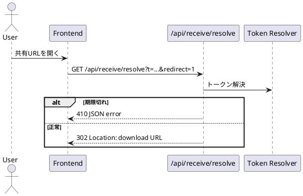

# API仕様書作成マニュアル（非IT部門向け・ヘッダー/クッキー強化版）

## 1. 目的・対象範囲・読者

### 1.1 目的
このマニュアルは、`apps/web/api` 配下のAPI仕様書を同じ品質・同じ書式で作成するためのルールです。  
特に以下を重視します。

1. 実装と仕様の不一致を防ぐ。
2. 非IT部門にも意図が伝わる説明を書く。
3. リクエストヘッダー、レスポンスヘッダー、クッキーを漏れなく記載する。
4. Markdown本文とOpenAPI断片を併記し、契約を機械的にも人間的にも読める状態にする。

### 1.2 対象範囲
対象は `apps/web/api` 配下の全エンドポイントです（例: `auth`, `discord`, `blob`, `receive`, `transfer`）。

### 1.3 想定読者
1. 開発者（フロントエンド、バックエンド、QA）。
2. 運用担当者。
3. 非IT部門の関係者（業務企画、サポート、管理部門）。

### 1.4 本マニュアルでの基本方針
1. 文章はMarkdownで記述する。
2. 図はMermaidを標準とし、表現が難しい場合のみPlantUMLを使う。
3. 「未確認」は `TBD` ではなく「未確認項目」として明記する。
4. 実APIの挙動は変更しない。変更対象はドキュメント契約のみ。

---

## 2. 執筆原則（非IT部門向け説明、契約と実装の整合）

### 2.1 非IT部門向け説明の必須ルール
各APIセクションの冒頭に、次の形式で2〜4行の説明を入れます。

1. このAPIで何ができるか。
2. 利用者にとっての価値（業務上の意味）。
3. 失敗時に何が起こるか（利用者視点）。

#### 記述例
`/api/receive/resolve` は共有リンクを実際のダウンロード先に変換するAPIです。  
利用者は短いURLを扱うだけで済み、長い一時URLを直接管理する必要がありません。  
期限切れの場合は取得できず、利用者には「再発行が必要」であることを案内します。

### 2.2 専門用語の書き方
専門用語は初出で必ず説明します。

- CSRF（第三者による「なりすまし送信」を防ぐ仕組み）
- Origin（リクエスト元のサイト情報）
- Rate Limit（短時間の過剰アクセスを制限する安全策）
- PKCE（OAuth認証の安全性を高める追加検証）

### 2.3 実装との整合
仕様書の内容は、必ず実装から確認した事実で書きます。  
推測で書かないこと。確認できないものは「未確認項目」として列挙します。

---

## 3. 必須セクション定義（エンドポイント単位）

各エンドポイントは、以下のセクションを必須とします。

1. `Endpoint Summary`
2. `Non-IT向け説明`
3. `Request`（Query / Body / Headers / Cookies）
4. `Response`（Statusごと）
5. `Response Headers`
6. `Set-Cookie`
7. `認証・認可`
8. `エラーと利用者影響`
9. `業務影響`
10. `OpenAPI snippet`
11. `未確認項目`
12. `Glossary`

---

## 4. ヘッダー記述ルール（Request / Response）

### 4.1 Request Headers の最低カバレッジ語彙
以下のヘッダーは、該当する場合に必ず記載します。

1. `Origin`
2. `Referer`
3. `Host`
4. `Cookie`
5. `Content-Type`
6. `Accept`
7. `x-csrf-token`
8. `x-forwarded-for`（インフラ由来。クライアントが直接制御しない場合がある）

### 4.2 Response Headers の最低カバレッジ語彙
以下のヘッダーは、該当する場合に必ず記載します。

1. `Content-Type`
2. `Cache-Control`
3. `Allow`
4. `Retry-After`
5. `Location`
6. `Set-Cookie`

### 4.3 記述フォーマット
ヘッダーは以下の列で表にします。

| Header Name | Required | Example | Purpose | When |
| --- | --- | --- | --- | --- |
| `x-csrf-token` | Yes | `x-csrf-token: <token>` | CSRF対策の照合値 | `discord_*` 系APIのGET/POST |

### 4.4 実装上の既知動作（このリポジトリ）
1. Nodeガード (`apps/web/api/_lib/apiGuards.js`) では、`405` 時に `Allow` を返す。
2. レート制限超過時は `429` と `Retry-After` を返す。
3. 一部APIは `Accept` に応じて `JSON` と `HTML` を切り替える（例: `/api/auth/discord/start`, `/api/auth/discord/callback`）。
4. `/api/receive/resolve?redirect=1` は `302` と `Location` を返す。

---

## 5. クッキー記述ルール

### 5.1 Cookie の最低カバレッジ語彙
以下を基準語彙とし、該当するAPIで必ず説明します。

1. `sid`
2. `csrf`
3. `discord_csrf`
4. `d_state`
5. `d_verifier`
6. `d_login_context`
7. `d_pwa_bridge`

### 5.2 クッキー属性の記述ルール
`Set-Cookie` を返す場合、必ず以下を記載します。

1. `HttpOnly`
2. `Secure`
3. `SameSite`
4. `Path`
5. `Max-Age`
6. `Domain`（設定される場合）

### 5.3 実装で観測できる既定値（このリポジトリ）
`apps/web/api/_lib/cookies.js` の既定値:

- `HttpOnly: true`
- `Secure: true`
- `SameSite: lax`
- `Path: /`

`apps/web/api/_lib/csrf.js` の既定CSRFクッキー設定:

- `Domain: .shimmy3.com`（`csrf` / `discord_csrf` 発行時）

### 5.4 記述フォーマット

| Cookie Name | Direction | Required | Purpose | Attributes | Notes |
| --- | --- | --- | --- | --- | --- |
| `sid` | Request / Set-Cookie | Depends | ログインセッション識別子 | `HttpOnly`, `Secure`, `SameSite=Lax`, `Path=/`, `Max-Age=2592000` | ログアウト時は削除 (`Max-Age=0`) |

---

## 6. エラー・認証・セキュリティ記述ルール

### 6.1 認証・認可
APIごとに次を明記します。

1. セッション要否（`sid` 必須か）。
2. CSRF要否（`cookie + body/header` の照合）。
3. Origin検証要否。
4. レート制限有無（制限値、窓時間）。

### 6.2 エラー記述
エラーは「技術的理由」だけでなく、次を分けて書きます。

1. 利用者に起きる現象（画面、操作上の影響）。
2. 運用側の対応（再試行、設定確認、期限再発行など）。

例:

- `403 Forbidden: invalid CSRF token`
  - 利用者影響: 操作が拒否される。再操作が必要。
  - 運用対応: CSRF発行API再取得、Cookie有効性確認。

### 6.3 主要ステータスの標準記載
成功系だけでなく、原則として以下を確認して記載します。

1. `401`
2. `403`
3. `404`
4. `409`
5. `410`
6. `429`
7. `500`

---

## 7. 命名規則（関数名・変数名・型名）

### 7.1 関数名
`動詞 + 対象 + 目的` を基本にします。

- `validateRequestOriginHeader`
- `buildSessionCookieAttributes`
- `resolveRedirectResponseLocation`

### 7.2 変数名
`中身 + 単位/種類 + 文脈` を基本にします。

- `requestOriginHeaderValue`
- `csrfTokenCookieValue`
- `sessionIdCookieValue`
- `retryAfterSecondsValue`

### 7.3 ブール値
`is` / `has` / `can` / `should` で開始します。

- `isOriginAllowed`
- `hasValidCsrfToken`
- `canResolveShortToken`
- `shouldReturnHtmlResponse`

### 7.4 禁止例
意味が不明確な短縮形を避けます。

- `reqHdrVal`（禁止）
- `tmp1`, `tmp2`（禁止）
- `flg`（禁止）

### 7.5 補足コメント
意図が伝わりにくい場合のみ、短くコメントを付けます。

```ts
// retry window for client backoff guidance
const retryAfterSecondsValue = 60;
```

---

## 8. Mermaid / PlantUML 図表ルール

### 8.1 基本方針
1. 状態遷移があるAPIはMermaidシーケンス図を必須とする。
2. Mermaidで表現しづらい複雑図のみPlantUMLを許可する。
3. 図には「登場人物」「入力」「出力」「失敗時分岐」を必ず含める。

### 8.2 Mermaid例（必須）

```mermaid
sequenceDiagram
  participant Client as Browser
  participant API as /api/auth/logout
  participant Guard as withApiGuards
  participant Session as Session Store

  Client->>API: POST /api/auth/logout (csrf in body)
  API->>Guard: validate Origin + CSRF + RateLimit
  alt validation failed
    Guard-->>Client: 403/429 JSON error
  else validation passed
    API->>Session: delete session by sid
    API-->>Client: 200 {ok:true} + Set-Cookie(sid; Max-Age=0)
  end
```

### 8.3 PlantUML例（代替）



---

## 9. OpenAPI断片併記ルール

### 9.1 必須ルール
1. 各エンドポイントに `paths.<route>.<method>` 断片を載せる。
2. 本文のヘッダー/クッキー記述と不一致を禁止する。
3. 成功系と主要エラーを記載する。
4. `parameters/header` と `security` で認証・CSRF・主要ヘッダーを表現する。

### 9.2 記述例（/api/auth/logout）

```yaml
paths:
  /api/auth/logout:
    post:
      summary: Logout current session
      description: Delete session for current device and clear sid cookie.
      parameters:
        - in: header
          name: Origin
          required: true
          schema:
            type: string
        - in: header
          name: Cookie
          required: true
          schema:
            type: string
      requestBody:
        required: true
        content:
          application/json:
            schema:
              type: object
              required: [csrf]
              properties:
                csrf:
                  type: string
      responses:
        "200":
          description: Logout succeeded
          headers:
            Set-Cookie:
              description: clear sid cookie
              schema:
                type: string
          content:
            application/json:
              schema:
                type: object
                properties:
                  ok:
                    type: boolean
        "403":
          description: Forbidden (origin/csrf)
        "429":
          description: Too Many Requests
          headers:
            Retry-After:
              schema:
                type: string
        "500":
          description: Internal Server Error
```

---

## 10. PR運用ルール（API変更時の仕様更新必須）

### 10.1 必須運用
API実装に以下の変更がある場合、同一PRで仕様書更新を必須とします。

1. エンドポイント追加・削除・改名。
2. リクエスト/レスポンスの項目変更。
3. ヘッダー要件の変更。
4. クッキー挙動の変更。
5. ステータスコード追加・変更。

### 10.2 PRチェック項目
1. 対象エンドポイントの仕様更新があるか。
2. Request Headers / Cookies が記載されているか。
3. Response Headers / Set-Cookie が記載されているか。
4. Non-IT向け説明があるか。
5. OpenAPI断片が本文と一致しているか。
6. 未確認項目が適切に列挙されているか。

---

## 11. 完了条件（Definition of Done）

1. 必須セクションが全て埋まっている。
2. 実装で確認できたヘッダー・クッキーを網羅している。
3. 非IT部門が読んでも用途と影響を理解できる。
4. Mermaid図が1つ以上ある。
5. PlantUML図が1つ以上ある。
6. OpenAPI断片がある。
7. レビューチェックリストが全項目 `Yes` になっている。

---

# API仕様テンプレート（Markdown / コピペ用）

```md
# <API Name> 仕様

## Endpoint Summary
- Route: `<route>`
- Method: `<method>`
- Runtime: `node` | `edge`

## Non-IT向け説明
このAPIは<何ができるか>ための窓口です。  
利用者にとっては<価値>があり、失敗時は<現象>が起きます。  
業務上は<業務影響>に関わるため、運用で<対応方針>を定めます。

## Request

### Query Parameters
| Name | Type | Required | Example | Purpose |
| --- | --- | --- | --- | --- |
| `<name>` | `string` | Yes/No | `<value>` | `<purpose>` |

### Request Body
| Name | Type | Required | Example | Purpose |
| --- | --- | --- | --- | --- |
| `<name>` | `string` | Yes/No | `<value>` | `<purpose>` |

### Request Headers
| Header Name | Required | Example | Purpose | When |
| --- | --- | --- | --- | --- |
| `Origin` | Yes/No | `https://example.com` | 同一オリジン検証 | `origin: true` の場合 |
| `Referer` | Yes/No | `https://example.com/page` | Origin補助判定 | Origin未送信時 |
| `Host` | Yes/No | `example.com` | 自サイト判定/URL構築 | 常時 |
| `Cookie` | Yes/No | `sid=...; csrf=...` | セッション/CSRF | 認証系 |
| `Content-Type` | Yes/No | `application/json` | 本文形式識別 | POST/PUT |
| `Accept` | Yes/No | `application/json` | 応答形式切替 | JSON/HTML分岐API |
| `x-csrf-token` | Yes/No | `<token>` | CSRF照合 | header CSRF採用API |
| `x-forwarded-for` | No | `<ip>` | レート制限識別補助 | インフラ付与 |

### Request Cookies
| Cookie Name | Required | Example | Purpose | Attributes (if known) |
| --- | --- | --- | --- | --- |
| `sid` | Yes/No | `<session-id>` | ログイン状態識別 | `HttpOnly`, `Secure`, `SameSite=Lax`, `Path=/` |
| `csrf` | Yes/No | `<token>` | CSRF照合 | `Domain=.shimmy3.com` (CSRF発行API経由) |
| `discord_csrf` | Yes/No | `<token>` | Discord API用CSRF | `Domain=.shimmy3.com` (CSRF発行API経由) |

## Response

### Status Codes
| Status | Body Example | Meaning |
| --- | --- | --- |
| `200` | `{ "ok": true }` | 成功 |
| `401` | `{ "ok": false, "error": "..." }` | 未認証 |
| `403` | `{ "ok": false, "error": "..." }` | 禁止（Origin/CSRF等） |
| `404` | `{ "ok": false, "error": "..." }` | 対象なし |
| `409` | `{ "ok": false, "error": "..." }` | 状態不一致 |
| `410` | `{ "ok": false, "error": "..." }` | 期限切れ |
| `429` | `{ "ok": false, "error": "Too Many Requests" }` | レート制限 |
| `500` | `{ "ok": false, "error": "..." }` | サーバー内部エラー |

### Response Headers
| Header Name | Presence | Example | Purpose | When |
| --- | --- | --- | --- | --- |
| `Content-Type` | Always/Conditional | `application/json; charset=utf-8` | 応答形式明示 | JSON応答 |
| `Cache-Control` | Conditional | `no-store` | キャッシュ抑止 | セッション/認証結果 |
| `Allow` | Conditional | `GET, POST` | 許可メソッド通知 | 405 |
| `Retry-After` | Conditional | `60` | 再試行待機秒数 | 429 |
| `Location` | Conditional | `https://...` | リダイレクト先 | 302 |
| `Set-Cookie` | Conditional | `sid=...` | クッキー更新/削除 | ログイン/ログアウト |

### Set-Cookie
| Cookie Name | Trigger | Example | Attributes | Purpose |
| --- | --- | --- | --- | --- |
| `sid` | login/logout | `sid=...` or `sid=; Max-Age=0` | `HttpOnly`, `Secure`, `SameSite=Lax`, `Path=/` | セッション管理 |

## 認証・認可
- Session: Required/Not required
- CSRF: Required/Not required
- Origin check: Enabled/Disabled
- Rate limit: `<name>, <limit>/<windowSec>`

## エラーと利用者影響
| Error Case | User Impact | Operation Response |
| --- | --- | --- |
| `<error>` | `<impact>` | `<operation guidance>` |

## 業務影響
<1文で記載。例: 認証失敗時に受け取り業務が停止するため、再ログイン導線を必ず運用手順に含める。>

## OpenAPI snippet
```yaml
paths:
  <route>:
    <method-lowercase>:
      summary: <summary>
      responses:
        "200":
          description: OK
```

## 未確認項目
1. `<未確認項目>`

## Glossary
- `<term>`: `<plain explanation>`
```

---

# OpenAPI断片テンプレート（YAML / コピペ用）

```yaml
paths:
  /api/example:
    post:
      summary: Example endpoint summary
      description: Explain purpose in one to two lines.
      parameters:
        - in: header
          name: Origin
          required: true
          schema:
            type: string
        - in: header
          name: x-csrf-token
          required: false
          schema:
            type: string
      requestBody:
        required: true
        content:
          application/json:
            schema:
              type: object
              required: [csrf]
              properties:
                csrf:
                  type: string
      responses:
        "200":
          description: Success response
          headers:
            Content-Type:
              schema:
                type: string
            Set-Cookie:
              schema:
                type: string
        "401":
          description: Unauthorized
        "403":
          description: Forbidden
        "404":
          description: Not Found
        "409":
          description: Conflict
        "410":
          description: Gone
        "429":
          description: Too Many Requests
          headers:
            Retry-After:
              schema:
                type: string
        "500":
          description: Internal Server Error
      security: []
```

---

# 非IT部門向けサンプル（実APIベース）

## サンプルA: `GET /api/auth/discord/start`

### このAPIで何ができるか（平易説明）
このAPIは、Discordログインを開始するための「入口」を作ります。  
利用者はこのAPIで受け取ったURLに進むことで、Discord認証画面に移動できます。  
ログインの安全性を保つため、短時間だけ有効な検証情報をクッキーに保存します。  
業務上は「ログイン不能による利用停止」を防ぐ最重要APIの一つです。

### Request Headers（例）
| Header Name | Required | Purpose |
| --- | --- | --- |
| `Accept` | No | `application/json` 指定時はJSON応答、それ以外は302リダイレクト |
| `Host` | Yes | リダイレクトURI計算の補助（環境依存） |

### Request Cookies（例）
なし（このAPIは初回発行側）。

### Response Headers / Set-Cookie（例）
| Header Name | Presence | Example | Purpose |
| --- | --- | --- | --- |
| `Cache-Control` | Yes | `no-store` | 認証開始情報のキャッシュ防止 |
| `Allow` | Conditional | `GET` | メソッド不一致時（405） |
| `Location` | Conditional | `https://discord.com/oauth2/authorize?...` | HTML受信時はDiscordへ遷移 |
| `Set-Cookie` | Yes | `d_state=...` / `d_verifier=...` / `d_login_context=...` / `d_pwa_bridge=...` | 認証検証用情報の保存 |

### 仕様メモ
`Accept` が `application/json` の場合は `200` JSON、そうでない場合は `302` で遷移。

---

## サンプルB: `GET /api/receive/resolve`

### このAPIで何ができるか（平易説明）
このAPIは、共有用の短いトークンを実際のダウンロード先へ変換します。  
利用者は複雑なURLを意識せず、短い共有URLだけで受け取り操作ができます。  
期限切れや不正トークンは明確なエラーで判別されます。  
業務上は「誤配布や期限切れの問い合わせ対応」に直結します。

### Request Headers（例）
| Header Name | Required | Purpose |
| --- | --- | --- |
| `Origin` | Conditional | 同一オリジン判定（送信される場合） |
| `Referer` | Conditional | `Origin` 不在時の補助 |
| `Host` | Yes | 自サイト判定補助 |

### Query（例）
| Name | Required | Example | Purpose |
| --- | --- | --- | --- |
| `t` | Yes | `AbCdEf...` | 共有トークン |
| `redirect` | No | `1` | 指定時は302で直接遷移 |

### Response Headers（例）
| Header Name | Presence | Example | Purpose |
| --- | --- | --- | --- |
| `Location` | Conditional | `https://...blob.vercel-storage.com/...` | `redirect=1` 時の遷移先 |
| `Retry-After` | Conditional | `60` | レート制限時の再試行案内 |
| `Allow` | Conditional | `GET` | メソッド不一致時 |

### 仕様メモ
`redirect=1` の場合は `302 + Location`、未指定は `200 JSON`。

---

## サンプルC: `POST /api/auth/logout`

### このAPIで何ができるか（平易説明）
このAPIは、現在の端末のログイン状態を安全に解除します。  
利用者は明示的にログアウトでき、共有端末利用時の情報残存リスクを下げられます。  
CSRF検証と同一オリジン検証により、不正なログアウト要求を防ぎます。  
業務上は「意図しないログイン継続による情報漏えい抑止」に重要です。

### Request Headers（例）
| Header Name | Required | Purpose |
| --- | --- | --- |
| `Origin` | Conditional | 同一オリジン検証（送信される場合） |
| `Cookie` | Yes | `sid`, `csrf` の受け渡し |
| `Content-Type` | Yes | `application/json` |

### Request Body（例）
| Name | Type | Required | Purpose |
| --- | --- | --- | --- |
| `csrf` | string | Yes | `csrf` クッキーとの照合値 |

### Response Headers / Set-Cookie（例）
| Header Name | Presence | Example | Purpose |
| --- | --- | --- | --- |
| `Set-Cookie` | Conditional | `sid=; Max-Age=0; Path=/; HttpOnly; Secure; SameSite=Lax` | セッション削除 |
| `Retry-After` | Conditional | `60` | レート制限時 |
| `Allow` | Conditional | `POST` | メソッド不一致時 |

---

## サンプルD: `GET /api/discord/members`（`discord_csrf` と `x-csrf-token` 対応）

### ヘッダー・クッキー対応関係
| Item | Value | Purpose |
| --- | --- | --- |
| Cookie | `discord_csrf=<token>` | サーバー側保存値 |
| Header | `x-csrf-token: <token>` | クライアント送信値 |
| 判定 | `discord_csrf === x-csrf-token` | CSRF照合成立 |

---

# 用語説明（Glossary）

- API: システム同士がデータをやり取りするための窓口。
- Header: リクエストやレスポンスに添える補足情報。
- Cookie: ブラウザに保存される小さな情報。セッション管理に使う。
- Session: ログイン状態など、利用者の状態情報。
- CSRF: 第三者サイトからの不正操作を防ぐ仕組み。
- Origin: リクエスト送信元のサイト起点情報。
- Referer: 遷移元ページ情報。
- Rate Limit: 短時間アクセスを制限する仕組み。
- PKCE: OAuth認証を安全にする追加検証方式。

---

# レビュー用チェックリスト

## A. 構成チェック
- [ ] 必須11章が存在する。
- [ ] APIテンプレートが同一ファイル内にある。
- [ ] OpenAPI断片テンプレートが同一ファイル内にある。
- [ ] Mermaid図が1つ以上ある。
- [ ] PlantUML例が1つ以上ある。

## B. ヘッダー/クッキーチェック
- [ ] `Request Headers` テーブルがある。
- [ ] `Request Cookies` テーブルがある。
- [ ] `Response Headers` テーブルがある。
- [ ] `Set-Cookie` テーブルがある。
- [ ] `Origin`, `Referer`, `Host`, `Cookie`, `Content-Type`, `Accept`, `x-csrf-token`, `x-forwarded-for` の該当有無を判定している。
- [ ] `Content-Type`, `Cache-Control`, `Allow`, `Retry-After`, `Location`, `Set-Cookie` の該当有無を判定している。
- [ ] `sid`, `csrf`, `discord_csrf`, `d_state`, `d_verifier`, `d_login_context`, `d_pwa_bridge` の該当有無を判定している。
- [ ] クッキー属性（`HttpOnly`, `Secure`, `SameSite=Lax`, `Path=/`, `Max-Age`）を説明している。

## C. 非IT部門向けチェック
- [ ] 各API冒頭に2〜4行の平易説明がある。
- [ ] 専門用語の初出説明がある。
- [ ] ヘッダー/クッキーの目的説明がある。
- [ ] エラー説明が「利用者影響」と「運用対応」で分離されている。
- [ ] 各セクションに業務影響の1文がある。

## D. 契約整合チェック
- [ ] 本文とOpenAPI断片に不一致がない。
- [ ] 成功系と主要エラー（`401`, `403`, `404`, `409`, `410`, `429`, `500`）が記載されている。
- [ ] `security` / `parameters/header` の方針が記載されている。
- [ ] 不明点は `未確認項目` として列挙している。

## E. 指定シナリオ確認
- [ ] `GET /api/auth/discord/start` の `Accept` によるJSON/HTML分岐が表現できる。
- [ ] `GET /api/receive/resolve` の `redirect=1` と `Location` が表現できる。
- [ ] `POST /api/auth/logout` の `csrf` 本文、`Cookie`、`Set-Cookie(sid削除)` が表現できる。
- [ ] `GET /api/discord/*` の `discord_csrf` と `x-csrf-token` の対応関係が表現できる。
- [ ] `429` の `Retry-After` が表現できる。
