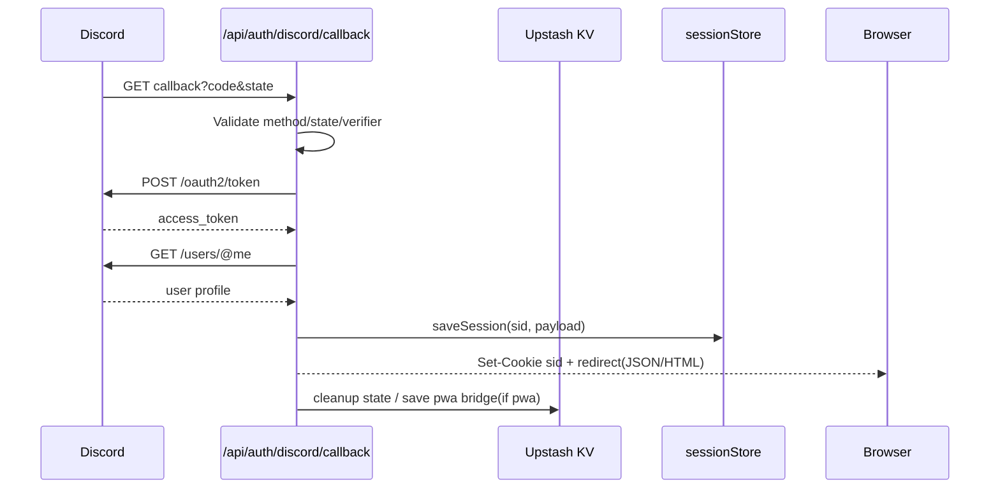
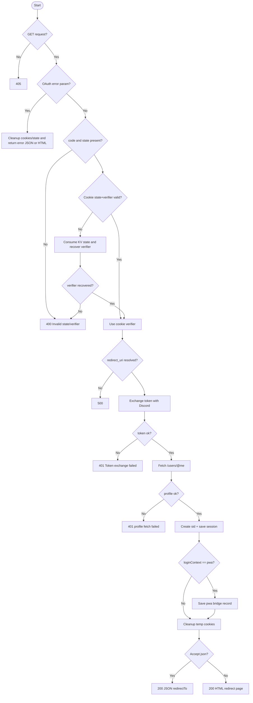

# API仕様書: `GET /api/auth/discord/callback`

## Endpoint Summary
- Route: `/api/auth/discord/callback`
- Method: `GET`
- Runtime: Node.js API Route
- 主な実装: `apps/web/api/auth/discord/callback.js`
- 主な呼び出し元: Discord OAuthコールバック（ブラウザ遷移）

## Non-IT向け説明
このAPIはDiscord認証の「戻り先」で、ログインを最終確定します。  
認可コードをDiscordへ送ってアクセストークンを取得し、アプリ用セッションを発行します。  
通常は最終的にアプリ画面へ戻しますが、条件によりJSONまたはHTMLで結果を返します。  
業務上はログイン成功率に直結する重要APIです。

## 利用フロー（Flow / 道筋）
| Item | 内容 |
| --- | --- |
| 起点機能/画面 | Discord認可画面でユーザーが許可/拒否 |
| 呼び出しトリガー | Discordが `code` / `state` を付けて本APIへリダイレクト |
| 前段API/処理 | `/api/auth/discord/start` で state/verifier を発行済み |
| 当APIの役割 | state検証、Discordトークン交換、`sid` 発行、復帰先決定 |
| 後段API/処理 | フロントが `/api/discord/me` 等でログイン状態再取得 |
| 失敗時経路 | 認可拒否・state不一致・Discord API失敗時はエラー応答 |
| 利用者への見え方 | 成功時は画面復帰、失敗時は再ログインが必要 |

### フロー図（Mermaid: sequence）


### アルゴリズムフロー（Mermaid: flowchart）


## Request

### Query Parameters
| Name | Type | Required | Example | Purpose |
| --- | --- | --- | --- | --- |
| `code` | string | Conditional | `abc...` | Discord認可コード（成功時） |
| `state` | string | Conditional | `xyz...` | start時のstate照合 |
| `error` | string | No | `access_denied` | ユーザー拒否などOAuthエラー |
| `error_description` | string | No | `The resource owner denied...` | エラー補足 |
| `format` | string | No | `json` | JSON応答を強制 |

### Request Headers
| Header Name | Required | Example | Purpose | When |
| --- | --- | --- | --- | --- |
| `Cookie` | Yes | `d_state=...; d_verifier=...` | state/verifier読み取り |
| `Accept` | No | `application/json` | JSON/HTML応答分岐 |

### Request Cookies
| Cookie Name | Required | Purpose |
| --- | --- | --- |
| `d_state` | Conditional | state照合 |
| `d_verifier` | Conditional | PKCE verifier復元 |
| `d_login_context` | Conditional | browser/pwa判定 |
| `d_pwa_bridge` | Conditional | PWAブリッジ照合補助 |

## Response

### Status Codes
| Status | Body Example | Meaning |
| --- | --- | --- |
| `200` | `{ "ok": true, "redirectTo":"/..." }` or HTML | ログイン成功、もしくはOAuthエラー時の案内HTML |
| `400` | `Invalid state or verifier` / `{ ok:false, error:"OAuth error" }` | state/verifier不正、OAuthエラー |
| `401` | `Token exchange failed: ...` | Discord API認証失敗 |
| `405` | `{ "ok": false, "error": "Method Not Allowed" }` | GET以外 |
| `500` | `Discord redirect_uri is not configured` | 環境設定不足 |

### Response Headers
| Header Name | Presence | Example | Purpose | When |
| --- | --- | --- | --- | --- |
| `Allow` | Conditional | `GET` | メソッド制約通知 | `405` |
| `Cache-Control` | Yes | `no-store` | 認証応答キャッシュ防止 | 主要応答 |
| `Content-Type` | Conditional | `text/html; charset=utf-8` | HTML案内ページ返却 | HTML応答時 |
| `Set-Cookie` | Yes | `sid=...` / `d_state=; Max-Age=0` | セッション発行・一時cookie整理 |

### Set-Cookie
| Cookie Name | Trigger | Attributes | Purpose |
| --- | --- | --- | --- |
| `sid` | ログイン成功 | `HttpOnly`, `Secure`, `SameSite=Lax`, `Path=/`, `Max-Age=2592000` | ログインセッション |
| `d_state` | 成否問わず整理時 | `Max-Age=0` | 一時state削除 |
| `d_verifier` | 成否問わず整理時 | `Max-Age=0` | 一時verifier削除 |
| `d_login_context` | 成否問わず整理時 | `Max-Age=0` | 一時context削除 |
| `d_pwa_bridge` | OAuthエラー時など | `Max-Age=0` | PWAブリッジ情報削除 |

## 認証・認可
- Session: 不要（本API自体がセッション発行側）
- CSRF: 不要
- Origin check: 未実装
- Rate limit: 未実装

## エラーと利用者影響
| Error Case | User Impact | Operation Response |
| --- | --- | --- |
| `400` state不一致 | ログイン完了できない | startから再ログイン |
| `400` OAuth error | 認可拒否で未ログイン | 許可操作を案内 |
| `401` Discord API失敗 | ログイン不可 | Discord接続状況確認、再試行 |
| `500` 設定不足 | 全利用者がログイン不可 | 環境変数修正 |

## 業務影響
このAPI障害はログイン不能として顕在化し、Discord連携機能が全面停止するため、運用監視対象です。

## OpenAPI snippet
```yaml
paths:
  /api/auth/discord/callback:
    get:
      summary: Finalize Discord OAuth login
      parameters:
        - in: query
          name: code
          schema:
            type: string
        - in: query
          name: state
          schema:
            type: string
        - in: query
          name: error
          schema:
            type: string
        - in: query
          name: format
          schema:
            type: string
            enum: [json]
      responses:
        "200":
          description: Login finalized (JSON or HTML)
        "400":
          description: Invalid state/verifier or OAuth error
        "401":
          description: Discord API exchange failed
        "405":
          description: Method Not Allowed
          headers:
            Allow:
              schema:
                type: string
        "500":
          description: Redirect URI not configured
      security: []
```

## 未確認項目
1. HTML応答時のService Worker挙動に関する将来的な互換方針。

## Glossary
- OAuth callback: 外部認証後に戻る受け口API。
- sid: 本アプリ内のログインセッションID。
