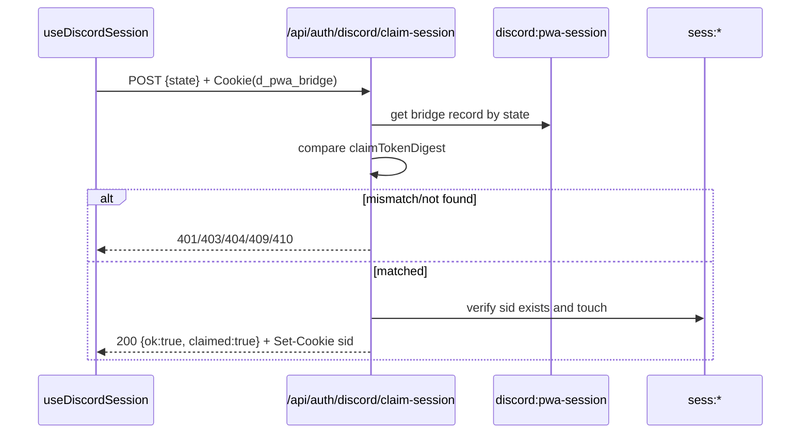
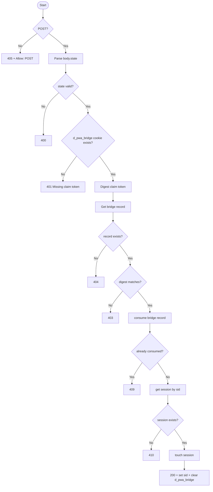

# API仕様書: `POST /api/auth/discord/claim-session`

## Endpoint Summary
- Route: `/api/auth/discord/claim-session`
- Method: `POST`
- Runtime: Node.js API Route
- 主な実装: `apps/web/api/auth/discord/claim-session.js`
- 主な呼び出し元: `apps/web/src/features/discord/useDiscordSession.ts` (`claimPendingPwaSession()`)

## Non-IT向け説明
このAPIはPWAログイン復帰時に、保留中の認証結果を現在のアプリ画面へ引き渡すためのAPIです。  
別画面で認証が完了した後、同じ端末かどうかを確認してセッションを再発行します。  
不正なトークンや期限切れ状態は拒否されます。  
業務上はPWA利用者のログイン成功率に影響します。

## 利用フロー（Flow / 道筋）
| Item | 内容 |
| --- | --- |
| 起点機能/画面 | PWA復帰時の自動セッション復旧処理 |
| 呼び出しトリガー | `useDiscordSession` が `localStorage` 内stateを検出 |
| 前段API/処理 | `/api/auth/discord/callback` がPWAブリッジをKVへ保存済み |
| 当APIの役割 | `state` と `d_pwa_bridge` を照合し `sid` を再発行 |
| 後段API/処理 | `discord/session` クエリ再取得 |
| 失敗時経路 | `401/403/404/409/410` はpending stateをクリアして再ログイン |
| 利用者への見え方 | 成功時はログイン状態へ復帰、失敗時は再ログインが必要 |

### フロー図（Mermaid: sequence）


### アルゴリズムフロー（Mermaid: flowchart）


## Request

### Request Body
| Name | Type | Required | Example | Purpose |
| --- | --- | --- | --- | --- |
| `state` | string | Yes | `AbCd...` | PWAブリッジ識別キー |

### Request Headers
| Header Name | Required | Example | Purpose | When |
| --- | --- | --- | --- | --- |
| `Content-Type` | Yes | `application/json` | Body解析 |
| `Accept` | No | `application/json` | 応答期待形式 |
| `Cookie` | Yes | `d_pwa_bridge=...` | 同一端末証明 |

### Request Cookies
| Cookie Name | Required | Purpose |
| --- | --- | --- |
| `d_pwa_bridge` | Yes | stateに紐づくクレームトークン |

## Response

### Status Codes
| Status | Body Example | Meaning |
| --- | --- | --- |
| `200` | `{ "ok": true, "claimed": true }` | セッション再発行成功 |
| `400` | `{ "ok": false, "error": "State is required" }` | リクエスト不正 |
| `401` | `{ "ok": false, "error": "Missing claim token" }` | クッキー欠落/不正 |
| `403` | `{ "ok": false, "error": "Invalid claim token" }` | ダイジェスト不一致 |
| `404` | `{ "ok": false, "error": "Session not found" }` | ブリッジなし |
| `409` | `{ "ok": false, "error": "Session already claimed" }` | 二重claim |
| `410` | `{ "ok": false, "error": "Session expired" }` | セッション期限切れ |
| `500` | `{ "ok": false, "error": "Internal Server Error" }` | 内部エラー |

### Response Headers
| Header Name | Presence | Example | Purpose | When |
| --- | --- | --- | --- | --- |
| `Allow` | Conditional | `POST` | メソッド通知 | `405` |
| `Cache-Control` | Yes | `no-store` | 応答キャッシュ防止 | 常時 |
| `Set-Cookie` | Conditional | `sid=...` / `d_pwa_bridge=; Max-Age=0` | セッション更新とクレームトークン破棄 | 成功時 |

### Set-Cookie
| Cookie Name | Trigger | Attributes | Purpose |
| --- | --- | --- | --- |
| `sid` | 成功時 | `HttpOnly`, `Secure`, `SameSite=Lax`, `Path=/`, `Max-Age=2592000` | セッション再発行 |
| `d_pwa_bridge` | 成功時 | `Max-Age=0` | ワンタイムトークン破棄 |

## 認証・認可
- Session: 不要（このAPIで再設定）
- CSRF: 未実装（本APIは独自トークン照合）
- Origin check: 未実装
- Rate limit: 未実装

## エラーと利用者影響
| Error Case | User Impact | Operation Response |
| --- | --- | --- |
| `401/403` | 復旧失敗で未ログインのまま | pending stateクリアし再ログイン |
| `404/409/410` | 復旧対象が無効 | state破棄して再ログイン導線 |
| `500` | 復旧結果不明 | リロード後に再試行 |

## 業務影響
PWAで復帰失敗が続くと利用離脱につながるため、失敗コード別のUX誘導が重要です。

## OpenAPI snippet
```yaml
paths:
  /api/auth/discord/claim-session:
    post:
      summary: Claim PWA bridged session
      requestBody:
        required: true
        content:
          application/json:
            schema:
              type: object
              required: [state]
              properties:
                state:
                  type: string
      responses:
        "200":
          description: Session claimed
        "400":
          description: Invalid request body
        "401":
          description: Missing or invalid claim token
        "403":
          description: Claim token mismatch
        "404":
          description: Bridge record not found
        "409":
          description: Already claimed
        "410":
          description: Session expired
        "500":
          description: Internal Server Error
      security: []
```

## 未確認項目
1. 将来的にOrigin/RateLimitを追加する場合の互換方針。

## Glossary
- Claim: 保留状態のセッションを現在コンテキストへ引き渡す操作。
- PWA bridge record: Safari認証完了後にPWA側へsidを渡すための一時レコード。
