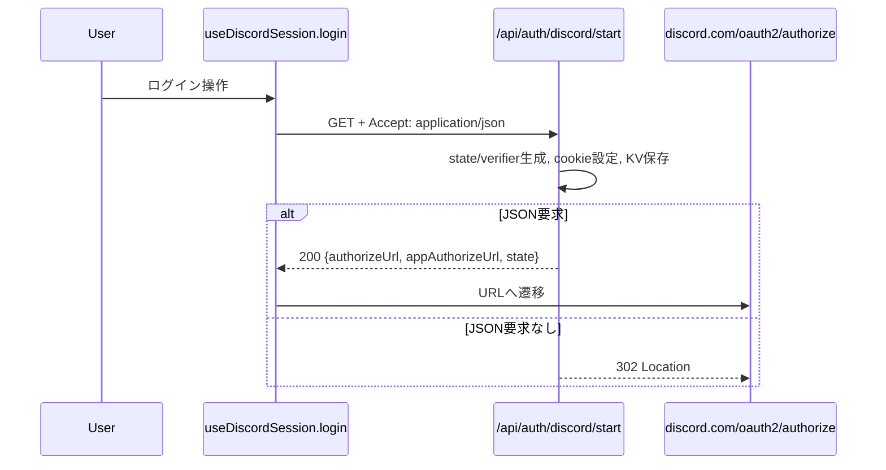
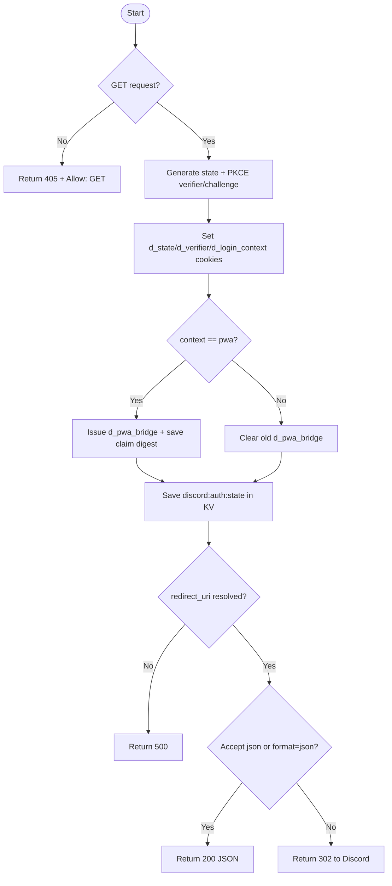

# API仕様書: `GET /api/auth/discord/start`

## Endpoint Summary
- Route: `/api/auth/discord/start`
- Method: `GET`
- Runtime: Node.js API Route
- 主な実装: `apps/web/api/auth/discord/start.js`
- 主な呼び出し元: `apps/web/src/features/discord/useDiscordSession.ts` (`login()`)

## Non-IT向け説明
このAPIはDiscordログインを始めるための入口です。  
ブラウザやPWAの利用状況に応じて、認証に必要な一時情報を発行します。  
利用者には「Discordの認可画面に進むURL」または自動リダイレクト結果を返します。  
業務上は、ログイン不能時に全機能が使えなくなるため重要です。

## 利用フロー（Flow / 道筋）
| Item | 内容 |
| --- | --- |
| 起点機能/画面 | Discordログインボタン |
| 呼び出しトリガー | `useDiscordSession.login()` 実行 |
| 前段API/処理 | なし |
| 当APIの役割 | OAuth開始情報（state, verifier）発行とDiscord認可URL生成 |
| 後段API/処理 | ブラウザがDiscord認可画面へ遷移し、`/api/auth/discord/callback` へ戻る |
| 失敗時経路 | `500` なら環境変数不足として再設定、`405` なら実装不整合確認 |
| 利用者への見え方 | 認可画面へ進む / エラー時はログイン失敗 |

### フロー図（Mermaid: sequence）


### アルゴリズムフロー（Mermaid: flowchart）


## Request

### Query Parameters
| Name | Type | Required | Example | Purpose |
| --- | --- | --- | --- | --- |
| `context` | string | No | `browser` / `pwa` | ログインコンテキスト判定 |
| `returnTo` | string | No | `/gacha?tab=save` | ログイン完了後の復帰先候補 |
| `format` | string | No | `json` | JSONレスポンスを強制 |

### Request Body
なし

### Request Headers
| Header Name | Required | Example | Purpose | When |
| --- | --- | --- | --- | --- |
| `Accept` | No | `application/json` | JSON/302応答分岐 | 通常 |
| `Host` | Yes | `shimmy3.com` | `redirect_uri` 解決補助 | 常時 |

### Request Cookies
通常は必須なし（初回発行API）。

## Response

### Status Codes
| Status | Body Example | Meaning |
| --- | --- | --- |
| `200` | `{ "ok": true, "authorizeUrl": "...", "appAuthorizeUrl":"...", "state":"..." }` | JSONで認可URL返却 |
| `302` | なし（Locationヘッダー） | Discord認可画面へ遷移 |
| `405` | `{ "ok": false, "error": "Method Not Allowed" }` | GET以外 |
| `500` | `{ "ok": false, "error": "Discord redirect_uri is not configured" }` | 環境設定不足 |

### Response Headers
| Header Name | Presence | Example | Purpose | When |
| --- | --- | --- | --- | --- |
| `Cache-Control` | Yes | `no-store` | 認証開始情報のキャッシュ防止 | 成功時 |
| `Allow` | Conditional | `GET` | 許可メソッド通知 | `405` |
| `Location` | Conditional | `https://discord.com/oauth2/authorize?...` | Discord遷移先 | `302` |
| `Set-Cookie` | Yes | `d_state=...` など | 認証検証情報保存 | 成功時 |

### Set-Cookie
| Cookie Name | Trigger | Attributes | Purpose |
| --- | --- | --- | --- |
| `d_state` | 成功時 | `HttpOnly`, `Secure`, `SameSite=Lax`, `Path=/`, `Max-Age=600` | OAuth state照合 |
| `d_verifier` | 成功時 | `HttpOnly`, `Secure`, `SameSite=Lax`, `Path=/`, `Max-Age=600` | PKCE code_verifier保持 |
| `d_login_context` | 成功時 | `HttpOnly`, `Secure`, `SameSite=Lax`, `Path=/`, `Max-Age=600` | browser/pwa識別 |
| `d_pwa_bridge` | `context=pwa` 成功時 | `HttpOnly`, `Secure`, `SameSite=Lax`, `Path=/`, `Max-Age=600` | PWAセッション引き渡し用 |
| `d_pwa_bridge` | `context!=pwa` | `Max-Age=0` | 残留トークン削除 |

## 認証・認可
- Session: 不要
- CSRF: 不要
- Origin check: 未実装（このエンドポイント単体では強制していない）
- Rate limit: 未実装（このエンドポイント単体では強制していない）

## エラーと利用者影響
| Error Case | User Impact | Operation Response |
| --- | --- | --- |
| `405` | ログイン開始できない | クライアントのHTTPメソッド実装を確認 |
| `500` (`redirect_uri` 未設定) | ログイン不可 | 環境変数設定（`VITE_DISCORD_REDIRECT_URI` など）を修正 |

## 業務影響
ログイン開始に失敗するとDiscord連携機能全体が停止するため、環境変数の整備と監視が必須です。

## OpenAPI snippet
```yaml
paths:
  /api/auth/discord/start:
    get:
      summary: Start Discord OAuth flow
      parameters:
        - in: query
          name: context
          schema:
            type: string
            enum: [browser, pwa]
        - in: query
          name: returnTo
          schema:
            type: string
        - in: query
          name: format
          schema:
            type: string
            enum: [json]
      responses:
        "200":
          description: Authorization URL issued
          content:
            application/json:
              schema:
                type: object
        "302":
          description: Redirect to Discord authorize page
          headers:
            Location:
              schema:
                type: string
        "405":
          description: Method Not Allowed
          headers:
            Allow:
              schema:
                type: string
        "500":
          description: Redirect URI not configured
      security: []
```

## 未確認項目
1. 将来 `origin` チェックが追加された場合の後方互換方針。

## Glossary
- PKCE: OAuthの認可コードを安全に扱うための検証方式。
- state: OAuthリクエストとコールバックを関連付ける一時識別子。
