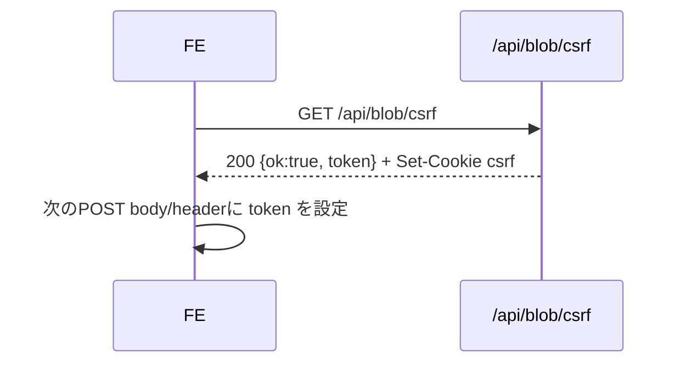

# API仕様書: `GET /api/blob/csrf`

## Endpoint Summary
- Route: `/api/blob/csrf`
- Method: `GET`
- Runtime: Node.js API Route
- 主な実装: `apps/web/api/blob/csrf.js`, `apps/web/api/_lib/csrf.js`
- 主な呼び出し元:
  - `apps/web/src/features/save/useBlobUpload.ts`
  - `apps/web/src/pages/receive/ReceivePage.tsx`
  - `apps/web/src/features/discord/useDiscordSession.ts` (logout前)

## Non-IT向け説明
このAPIは安全な書き込み操作の前に使う「ワンタイムの照合トークン」を発行します。  
受け取ったトークンはクッキーとJSONの両方に保存され、次のPOST時に一致確認されます。  
利用者には直接見えませんが、なりすまし送信防止に必須です。  
業務上はアップロード・削除・ログアウト等の安全性を支えます。

## 利用フロー（Flow / 道筋）
| Item | 内容 |
| --- | --- |
| 起点機能/画面 | ZIPアップロード、受け取り削除、ログアウト操作 |
| 呼び出しトリガー | 各機能がPOST前にCSRFを要求 |
| 前段API/処理 | なし |
| 当APIの役割 | `csrf` クッキーと同値tokenをJSONで返却 |
| 後段API/処理 | `/api/blob/upload`, `/api/receive/token`, `/api/receive/delete`, `/api/auth/logout` など |
| 失敗時経路 | 403/429なら再取得待機、設定確認 |
| 利用者への見え方 | 通常は見えない。失敗時のみ操作不能として顕在化 |

### フロー図（Mermaid: sequence）


### アルゴリズムフロー
該当なし（単純処理）。  
本APIは「トークン生成 -> Cookie設定 -> JSON返却」が主処理で、複雑な分岐やループはありません。

## Request

### Query Parameters
| Name | Type | Required | Example | Purpose |
| --- | --- | --- | --- | --- |
| `ts` | number | No | `1739700000000` | キャッシュ回避（クライアント側慣例） |
| `health` | string | No | `1` | ヘルスチェック |

### Request Headers
| Header Name | Required | Purpose |
| --- | --- | --- |
| `Origin` | Conditional | 同一オリジン検証 |
| `Referer` | Conditional | Origin補助判定 |
| `Host` | Yes | 自サイト判定補助 |

### Request Cookies
なし（発行側）

## Response

### Status Codes
| Status | Body Example | Meaning |
| --- | --- | --- |
| `200` | `{ "ok": true, "token": "..." }` | CSRF発行成功 |
| `403` | `{ "ok": false, "error": "Forbidden: origin not allowed" }` | Origin検証失敗 |
| `405` | `{ "ok": false, "error": "Method Not Allowed" }` | GET以外 |
| `429` | `{ "ok": false, "error": "Too Many Requests" }` | レート制限超過 |

### Response Headers
| Header Name | Presence | Example | Purpose | When |
| --- | --- | --- | --- | --- |
| `Cache-Control` | Yes | `no-store, max-age=0, must-revalidate` | トークンキャッシュ防止 | 成功時 |
| `Set-Cookie` | Yes | `csrf=...` | CSRFクッキー保存 | 成功時 |
| `Retry-After` | Conditional | `60` | 再試行待機時間 | `429` |
| `Allow` | Conditional | `GET` | メソッド通知 | `405` |

### Set-Cookie
| Cookie Name | Trigger | Attributes | Purpose |
| --- | --- | --- | --- |
| `csrf` | 成功時 | `HttpOnly`, `Secure`, `SameSite=Lax`, `Path=/`, `Domain=.shimmy3.com` | Double Submit Cookie照合元 |

## 認証・認可
- Session: 不要
- CSRF: 不要（このAPIが発行元）
- Origin check: 有効
- Rate limit: `blob:csrf`, `120 requests / 60 sec`

## エラーと利用者影響
| Error Case | User Impact | Operation Response |
| --- | --- | --- |
| `403` | 後続操作ができない | 正しいドメインで再試行 |
| `429` | 一時的に操作できない | `Retry-After` 待機 |

## 業務影響
CSRF発行停止は複数機能のPOST処理停止に直結するため、障害時は優先復旧対象です。

## OpenAPI snippet
```yaml
paths:
  /api/blob/csrf:
    get:
      summary: Issue CSRF token for blob-related POST APIs
      responses:
        "200":
          description: Token issued
        "403":
          description: Origin not allowed
        "405":
          description: Method Not Allowed
        "429":
          description: Too Many Requests
      security: []
```

## 未確認項目
1. `Domain=.shimmy3.com` の環境別最適化（開発/本番）方針。

## Glossary
- Double Submit Cookie: Cookieとリクエスト値の一致で正当性を確認する方式。
