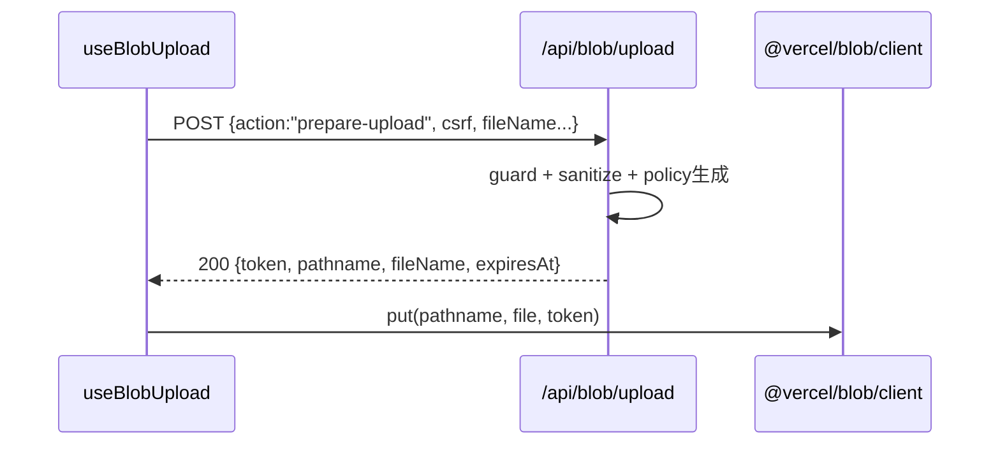

# API仕様書: `POST /api/blob/upload`

## Endpoint Summary
- Route: `/api/blob/upload`
- Method: `POST`
- Runtime: Node.js API Route
- 主な実装: `apps/web/api/blob/upload.js`
- 主な呼び出し元: `apps/web/src/features/save/useBlobUpload.ts` (`requestUploadAuthorization()`)

## Non-IT向け説明
このAPIは、ZIP本体を直接ストレージへ送る前に「アップロード許可情報」を払い出すAPIです。  
ファイル名や保存先を安全な形式へ正規化し、短時間だけ有効なアップロードトークンを返します。  
利用者はこのAPIの後にストレージへ直接アップロードします。  
業務上は共有ファイルの保存先整合性とセキュリティを担保します。

## 利用フロー（Flow / 道筋）
| Item | 内容 |
| --- | --- |
| 起点機能/画面 | 保存/共有（ZIPアップロード） |
| 呼び出しトリガー | `useBlobUpload.uploadZip()` 実行 |
| 前段API/処理 | `GET /api/blob/csrf` でtoken取得 |
| 当APIの役割 | 保存先path・有効期限・content-type制約付きトークン発行 |
| 後段API/処理 | `@vercel/blob/client put(...)` で直接アップロード |
| 失敗時経路 | 403/429/400時は入力・CSRF・待機確認 |
| 利用者への見え方 | 成功時はアップロード継続、失敗時はアップロード開始不可 |

### フロー図（Mermaid: sequence）


### アルゴリズムフロー（Mermaid: flowchart）
```mermaid
flowchart TD
  S([Start]) --> M{POST?}
  M -- No --> E405[405]
  M -- Yes --> G[Guard: origin + csrf + rate-limit]
  G --> A{body.action == prepare-upload?}
  A -- No --> E400[400 Bad Request]
  A -- Yes --> N[Sanitize user/file/dirs]
  N --> P[Derive pathname + validUntil + allowedContentTypes]
  P --> T[generateClientTokenFromReadWriteToken]
  T --> R{token issued?}
  R -- No --> E500[500 or mapped status]
  R -- Yes --> OK[200 {token, pathname, expiresAt...}]
```

## Request

### Request Body
| Name | Type | Required | Example | Purpose |
| --- | --- | --- | --- | --- |
| `action` | string | Yes | `prepare-upload` | 許可発行処理の指定 |
| `csrf` | string | Yes | `...` | CSRF照合 |
| `userId` | string | Yes | `user-1` | 送信者識別（path構成要素） |
| `fileName` | string | Yes | `sample.zip` | 元ファイル名 |
| `purpose` | string | No | `zips` | 用途識別 |
| `ownerDiscordId` | string | No | `123456` | 保存先オーナー識別 |
| `ownerDiscordName` | string | No | `owner` | 保存先ディレクトリ名候補 |
| `receiverName` | string | No | `receiver` | 受け取り側ディレクトリ名候補 |

### Request Headers
| Header Name | Required | Purpose |
| --- | --- | --- |
| `Content-Type` | Yes | JSONボディ解析 |
| `Cookie` | Yes | `csrf` クッキー照合 |
| `Origin` | Conditional | 同一オリジン検証 |
| `x-forwarded-for` | No | path suffix生成用IPハッシュ元 |

### Request Cookies
| Cookie Name | Required | Purpose |
| --- | --- | --- |
| `csrf` | Yes | bodyの `csrf` 値と照合 |

## Response

### Status Codes
| Status | Body Example | Meaning |
| --- | --- | --- |
| `200` | `{ "ok":true, "token":"...", "pathname":"...", "fileName":"..." }` | 許可トークン発行成功 |
| `400` | `{ "ok": false, "error": "Bad Request" }` | action不正 |
| `403` | `{ "ok": false, "error": "Forbidden: ..." }` | Origin/CSRF失敗 |
| `429` | `{ "ok": false, "error": "Too Many Requests" }` | レート制限 |
| `500` | `{ "ok": false, "error": "Failed to generate upload token" }` | 許可発行失敗 |

### Response Headers
| Header Name | Presence | Example | Purpose |
| --- | --- | --- | --- |
| `Content-Type` | Usually | `application/json; charset=utf-8` | JSON通知 |
| `Retry-After` | Conditional | `60` | 待機秒数 |
| `Allow` | Conditional | `POST` | メソッド通知 |

### Set-Cookie
なし

## 認証・認可
- Session: 必須ではない
- CSRF: 必須（`csrf` cookie + body一致）
- Origin check: 有効
- Rate limit: `blob:upload`, `60 requests / 60 sec`

## エラーと利用者影響
| Error Case | User Impact | Operation Response |
| --- | --- | --- |
| `400` | アップロード開始不可 | リクエストフォーマット修正 |
| `403` | アップロード開始不可 | CSRF再取得、オリジン確認 |
| `429` | 一時的に不可 | `Retry-After` 待機 |
| `500` | 許可トークン取得不可 | しばらく待って再試行、サーバーログ確認 |

## 業務影響
このAPI停止時はZIP共有が開始できず、バックアップ/配布業務に直接影響します。

## OpenAPI snippet
```yaml
paths:
  /api/blob/upload:
    post:
      summary: Prepare direct blob upload policy
      requestBody:
        required: true
        content:
          application/json:
            schema:
              type: object
              required: [action, csrf, userId, fileName]
      responses:
        "200":
          description: Upload policy issued
        "400":
          description: Bad Request
        "403":
          description: Forbidden (origin/csrf)
        "429":
          description: Too Many Requests
        "500":
          description: Upload policy issuance failed
      security: []
```

## 未確認項目
1. `BLOB_RATE_SECRET` 未設定時の運用上リスク（開発用既定値使用）。

## Glossary
- Upload policy: アップロード許可条件（保存先・期限・サイズ制限）の集合。
