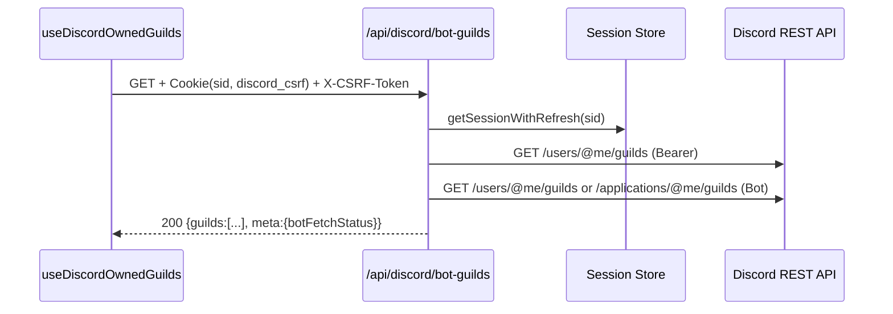
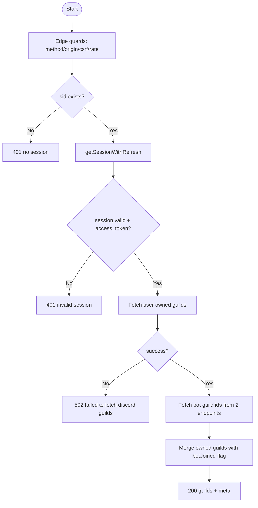

# API仕様書: `GET /api/discord/bot-guilds`

## Endpoint Summary
- Route: `/api/discord/bot-guilds`
- Method: `GET`
- Runtime: Edge Runtime API Route
- 主な実装: `apps/web/api/discord/bot-guilds.ts`
- 主な呼び出し元: `apps/web/src/features/discord/useDiscordOwnedGuilds.ts` (`fetchDiscordGuilds()`)

## Non-IT向け説明
このAPIは「ユーザーがオーナーのDiscordサーバー一覧」と「Bot参加状況」をまとめて返します。  
画面側はこの結果を使って、共有先として選べるサーバーを表示します。  
CSRFとセッションを両方確認し、不正な呼び出しを防ぎます。  
業務上は、共有先サーバーの選定品質とBot導入率に直結するAPIです。

## 利用フロー（Flow / 道筋）
| Item | 内容 |
| --- | --- |
| 起点機能/画面 | Discord Bot招待ダイアログのギルド一覧表示 |
| 呼び出しトリガー | `useDiscordOwnedGuilds` の `fetchDiscordGuilds()` |
| 前段API/処理 | `fetchDiscordApi` が `/api/discord/csrf` を先に呼びトークン取得 |
| 当APIの役割 | オーナーギルド一覧を取得し、Bot参加有無 (`botJoined`) を付与 |
| 後段API/処理 | UIでギルド選択可否（Bot参加済みか）を分岐表示 |
| 失敗時経路 | `401` は再ログイン、`502` はDiscord側一時障害として再試行 |
| 利用者への見え方 | 共有先として使えるサーバーが一覧表示される |

### フロー図（Mermaid: sequence）


### アルゴリズムフロー（Mermaid: flowchart）


## Request

### Query Parameters
なし（`health` は未対応）

### Request Body
なし

### Request Headers
| Header Name | Required | Example | Purpose | When |
| --- | --- | --- | --- | --- |
| `Origin` | Conditional | `https://shimmy3.com` | 許可オリジン検証 | 通常 |
| `Referer` | Conditional | `https://shimmy3.com/gacha` | Origin補助判定 | 通常 |
| `Host` | Yes | `shimmy3.com` | 自サイト判定補助 | 常時 |
| `Cookie` | Yes | `sid=...; discord_csrf=...` | セッション/CSRF照合 | 常時 |
| `x-csrf-token` | Yes | `<discord_csrf token>` | `discord_csrf` Cookieとの一致検証 | 常時 |
| `Accept` | No | `application/json` | JSON受信指定 | 通常 |
| `x-forwarded-for` | No | `203.0.113.10` | レート制限識別（インフラ由来） | 通常 |

### Request Cookies
| Cookie Name | Required | Example | Purpose |
| --- | --- | --- | --- |
| `sid` | Yes | `sid=...` | Discordセッション識別 |
| `discord_csrf` | Yes | `discord_csrf=...` | CSRF照合（ヘッダーと一致必須） |

## Response

### Status Codes
| Status | Body Example | Meaning |
| --- | --- | --- |
| `200` | `{ "ok": true, "guilds": [...], "meta": {"botFetchStatus":"ok"} }` | 取得成功 |
| `401` | `{ "ok": false, "error": "no session" }` | `sid` 不在/無効 |
| `403` | `{ "ok": false, "error": "Forbidden: invalid CSRF token" }` | Origin/CSRF不正 |
| `405` | `{ "ok": false, "error": "Method Not Allowed" }` | GET以外 |
| `429` | `{ "ok": false, "error": "Too Many Requests" }` | レート制限超過 |
| `500` | `{ "ok": false, "error": "failed to load session" }` | セッション読み出し失敗 |
| `502` | `{ "ok": false, "error": "failed to fetch discord guilds" }` | Discord API失敗 |

### Response Headers
| Header Name | Presence | Example | Purpose | When |
| --- | --- | --- | --- | --- |
| `Content-Type` | Yes | `application/json; charset=utf-8` | JSON本文通知 | 常時 |
| `Cache-Control` | Yes | `no-store, max-age=0, must-revalidate` | 一覧キャッシュ抑止 | 常時 |
| `Allow` | Conditional | `GET` | 許可メソッド通知 | `405` |

### Set-Cookie
なし

## 認証・認可
- Session: 必須（`sid`）
- CSRF: 必須（`discord_csrf` Cookie + `x-csrf-token` ヘッダー）
- Origin check: 有効
- Rate limit: `discord:bot-guilds`, `60 requests / 60 sec`

## エラーと利用者影響
| Error Case | User Impact | Operation Response |
| --- | --- | --- |
| `401` | ギルド一覧が表示できない | Discord再ログインを促す |
| `502` | 一時的にサーバー一覧更新不可 | 数秒後の再試行を案内 |
| `429` | 連続更新で一時ブロック | 操作間隔を空ける |

## 業務影響
ギルド一覧の解決に失敗するとBot招待後の設定導線が止まり、共有開始までのリードタイムが延びます。

## OpenAPI snippet
```yaml
paths:
  /api/discord/bot-guilds:
    get:
      summary: List owner guilds with bot join status
      parameters:
        - in: header
          name: x-csrf-token
          required: true
          schema:
            type: string
      responses:
        "200":
          description: Guild list resolved
        "401":
          description: Session missing or invalid
        "403":
          description: Forbidden (origin or csrf)
        "405":
          description: Method Not Allowed
          headers:
            Allow:
              schema:
                type: string
        "429":
          description: Too Many Requests
        "500":
          description: Failed to load session
        "502":
          description: Discord API fetch failed
      security:
        - cookieSid: []
          cookieDiscordCsrf: []
```

## 未確認項目
1. `meta.botFetchStatus=missing_token` 発生時の運用アラート基準。

## Glossary
- Edge Runtime: エッジ拠点で実行される軽量ランタイム。
- Guild: Discordのサーバー単位。
- BotJoined: BotがそのGuildに参加済みかを示すフラグ。
