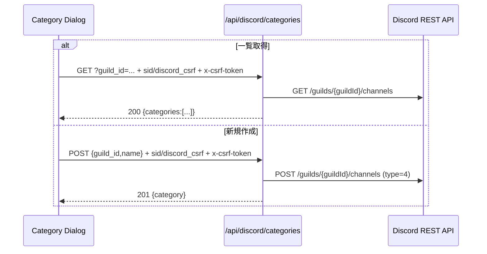
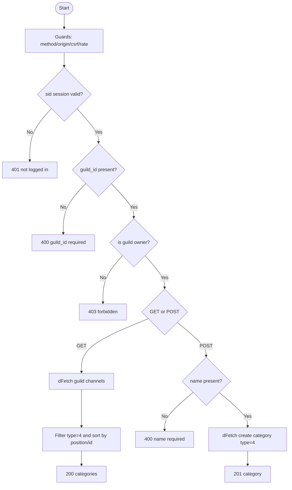

# API仕様書: `GET/POST /api/discord/categories`

## Endpoint Summary
- Route: `/api/discord/categories`
- Method: `GET`, `POST`
- Runtime: Node.js API Route
- 主な実装: `apps/web/api/discord/categories.js`
- 主な呼び出し元: `apps/web/src/modals/dialogs/DiscordPrivateChannelCategoryDialog.tsx`, `apps/web/src/features/discord/recoverDiscordCategoryLimit.ts`

## Non-IT向け説明
このAPIは、共有用カテゴリの「一覧取得」と「新規作成」を行います。  
利用者がDiscord共有設定でカテゴリを選ぶときの基盤です。  
操作対象のサーバーを本当に管理できる利用者か（オーナーか）を確認します。  
業務上は、カテゴリ設定が不安定だと共有先チャンネル作成フロー全体に影響します。

## 利用フロー（Flow / 道筋）
| Item | 内容 |
| --- | --- |
| 起点機能/画面 | Discordカテゴリ設定ダイアログ |
| 呼び出しトリガー | 画面表示時（一覧取得）/「カテゴリ作成」押下 |
| 前段API/処理 | `fetchDiscordApi` が `/api/discord/csrf` を実行 |
| 当APIの役割 | ギルドカテゴリ取得またはカテゴリ作成 |
| 後段API/処理 | 選択カテゴリ保存、`/api/discord/find-channels` 呼び出しへ進む |
| 失敗時経路 | `403/404/502` で警告ダイアログ表示 |
| 利用者への見え方 | カテゴリ一覧の表示・作成成功/失敗が即時反映 |

### フロー図（Mermaid: sequence）


### アルゴリズムフロー（Mermaid: flowchart）


## Request

### Query Parameters (`GET`)
| Name | Type | Required | Example | Purpose |
| --- | --- | --- | --- | --- |
| `guild_id` | string | Yes | `123456789012345678` | 対象DiscordギルドID |
| `health` | string | No | `1` | ヘルスチェック |

### Request Body (`POST`)
| Name | Type | Required | Example | Purpose |
| --- | --- | --- | --- | --- |
| `guild_id` | string | Yes | `123456789012345678` | 対象DiscordギルドID |
| `name` | string | Yes | `お渡しカテゴリ` | 新規カテゴリ名 |
| `csrf` | string | No | なし | 本APIではヘッダーCSRF運用のため未使用 |

### Request Headers
| Header Name | Required | Example | Purpose | When |
| --- | --- | --- | --- | --- |
| `Origin` | Conditional | `https://shimmy3.com` | 許可オリジン検証 | 常時 |
| `Referer` | Conditional | `https://shimmy3.com/gacha` | Origin補助判定 | 常時 |
| `Host` | Yes | `shimmy3.com` | 自サイト判定補助 | 常時 |
| `Cookie` | Yes | `sid=...; discord_csrf=...` | セッション/CSRF照合 | 常時 |
| `x-csrf-token` | Yes | `<discord_csrf token>` | CSRF照合値 | 常時 |
| `Content-Type` | `POST`でYes | `application/json` | JSON本文送信 | `POST` |
| `Accept` | No | `application/json` | JSON受信指定 | 常時 |
| `x-forwarded-for` | No | `203.0.113.10` | レート制限識別（インフラ由来） | 常時 |

### Request Cookies
| Cookie Name | Required | Example | Purpose |
| --- | --- | --- | --- |
| `sid` | Yes | `sid=...` | Discordセッション識別 |
| `discord_csrf` | Yes | `discord_csrf=...` | `x-csrf-token` との一致検証 |

## Response

### Status Codes
| Status | Body Example | Meaning |
| --- | --- | --- |
| `200` | `{ "ok": true, "categories": [{"id":"...","name":"...","position":1}] }` | 一覧取得成功 |
| `201` | `{ "ok": true, "category": {"id":"...","name":"...","position":0} }` | 作成成功 |
| `400` | `{ "ok": false, "error": "guild_id required" }` | 必須項目不足 |
| `401` | `{ "ok": false, "error": "not logged in" }` | セッションなし |
| `403` | `{ "ok": false, "error": "forbidden" }` | オーナー権限不足/CSRF/Origin不正 |
| `404` | `{ "ok": false, "error": "選択されたDiscordギルドを操作できません...", "errorCode":"discord_unknown_guild" }` | ギルド未到達 |
| `405` | `{ "ok": false, "error": "Method Not Allowed" }` | GET/POST以外 |
| `429` | `{ "ok": false, "error": "Too Many Requests" }` | レート制限超過 |
| `502` | `{ "ok": false, "error": "discord api request failed" }` | Discord API失敗 |

### Response Headers
| Header Name | Presence | Example | Purpose | When |
| --- | --- | --- | --- | --- |
| `Content-Type` | Usually | `application/json; charset=utf-8` | JSON本文通知 | 通常 |
| `Allow` | Conditional | `GET, POST` | 許可メソッド通知 | `405` |
| `Retry-After` | Conditional | `60` | 再試行待機秒数 | `429` |

### Set-Cookie
なし

## 認証・認可
- Session: 必須（`sid`）
- CSRF: 必須（`discord_csrf` Cookie + `x-csrf-token` ヘッダー）
- Origin check: 有効
- Rate limit: `discord:categories`, `30 requests / 60 sec`
- 追加認可: `assertGuildOwner` によるギルドオーナー検証

## エラーと利用者影響
| Error Case | User Impact | Operation Response |
| --- | --- | --- |
| `403` | カテゴリ操作不可 | ギルドオーナー権限/CSRFを確認 |
| `404` | ギルドが選べない | Bot参加状態を確認 |
| `502` | 一時的にカテゴリ取得不可 | 再試行を案内 |

## 業務影響
カテゴリ設定に失敗すると、その後の1:1チャンネル作成と共有メッセージ送信まで連鎖して止まります。

## OpenAPI snippet
```yaml
paths:
  /api/discord/categories:
    get:
      summary: List category channels in guild
      parameters:
        - in: query
          name: guild_id
          required: true
          schema:
            type: string
        - in: header
          name: x-csrf-token
          required: true
          schema:
            type: string
      responses:
        "200":
          description: Category list resolved
        "400":
          description: Missing guild_id
        "401":
          description: Not logged in
        "403":
          description: Forbidden (origin/csrf/owner)
        "404":
          description: Unknown guild
        "405":
          description: Method Not Allowed
        "429":
          description: Too Many Requests
        "502":
          description: Discord API failed
      security:
        - cookieSid: []
          cookieDiscordCsrf: []
    post:
      summary: Create category channel in guild
      requestBody:
        required: true
        content:
          application/json:
            schema:
              type: object
              required: [guild_id, name]
              properties:
                guild_id:
                  type: string
                name:
                  type: string
      responses:
        "201":
          description: Category created
        "400":
          description: Invalid request body
        "401":
          description: Not logged in
        "403":
          description: Forbidden (origin/csrf/owner)
        "404":
          description: Unknown guild
        "405":
          description: Method Not Allowed
        "429":
          description: Too Many Requests
        "502":
          description: Discord API failed
      security:
        - cookieSid: []
          cookieDiscordCsrf: []
```

## 未確認項目
1. Discord API側でカテゴリ作成直後に一覧へ反映されるまでの遅延分布。

## Glossary
- Guild Owner: Discordサーバーの管理者権限を持つユーザー。
- Category channel (`type=4`): テキスト/ボイスチャンネルを束ねる親カテゴリ。
