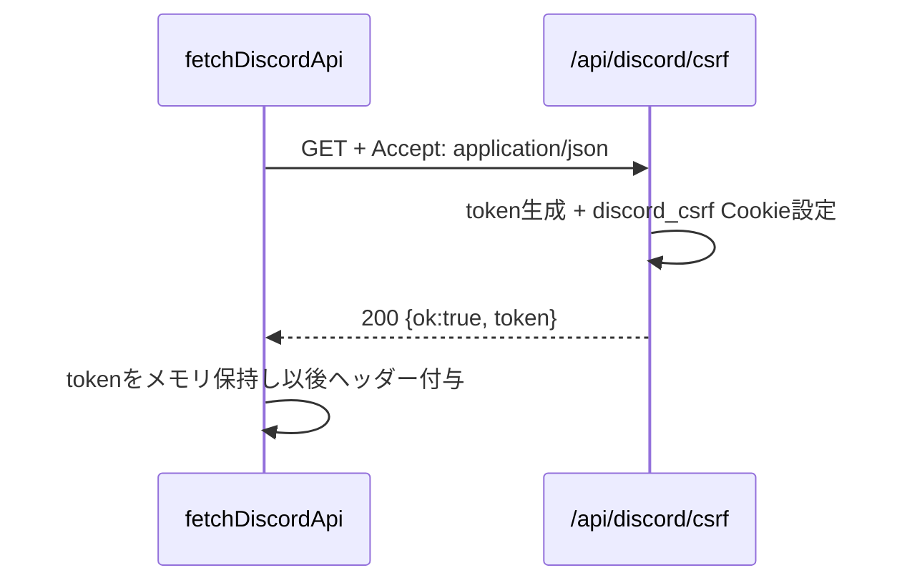
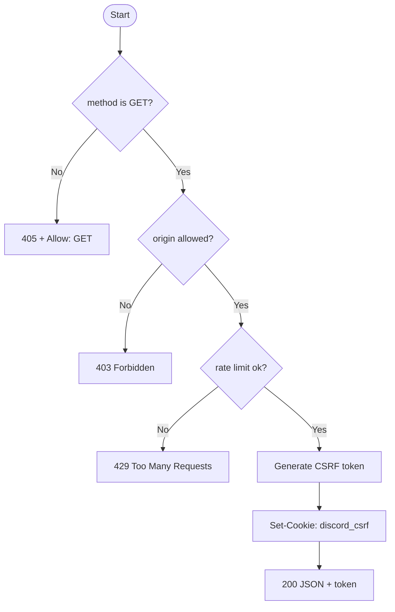

# API仕様書: `GET /api/discord/csrf`

## Endpoint Summary
- Route: `/api/discord/csrf`
- Method: `GET`
- Runtime: Node.js API Route
- 主な実装: `apps/web/api/discord/csrf.js`
- 主な呼び出し元: `apps/web/src/features/discord/fetchDiscordApi.ts` (`issueDiscordCsrfToken()`)

## Non-IT向け説明
このAPIはDiscord関連APIを安全に呼ぶための「CSRFトークン」を発行します。  
CSRFは、第三者サイトからのなりすまし送信を防ぐための仕組みです。  
画面側は、このAPIで受け取ったトークンを以後のヘッダーに付けて送信します。  
業務上は、不正送信対策と正当操作の両立に直結する基盤APIです。

## 利用フロー（Flow / 道筋）
| Item | 内容 |
| --- | --- |
| 起点機能/画面 | Discord関連操作の初回実行時 |
| 呼び出しトリガー | `fetchDiscordApi()` がCSRFトークン未保持時に呼ぶ |
| 前段API/処理 | なし |
| 当APIの役割 | `discord_csrf` Cookie と同値トークンを発行 |
| 後段API/処理 | 呼び出し側が `X-CSRF-Token` に設定して各APIを実行 |
| 失敗時経路 | `403`/`429` 時はDiscord API呼び出し自体を中断 |
| 利用者への見え方 | 失敗時はDiscord連携操作が開始できない |

### フロー図（Mermaid: sequence）


### アルゴリズムフロー（Mermaid: flowchart）


## Request

### Query Parameters
| Name | Type | Required | Example | Purpose |
| --- | --- | --- | --- | --- |
| `ts` | number | No | `1739700000000` | キャッシュ回避のための時刻 |
| `health` | string | No | `1` | ヘルスチェック |

### Request Body
なし

### Request Headers
| Header Name | Required | Example | Purpose | When |
| --- | --- | --- | --- | --- |
| `Origin` | Conditional | `https://shimmy3.com` | 許可オリジン検証 | 通常 |
| `Referer` | Conditional | `https://shimmy3.com/gacha` | Origin補助判定 | 通常 |
| `Host` | Yes | `shimmy3.com` | 自サイト判定補助 | 常時 |
| `Accept` | No | `application/json` | JSON受信指定 | 通常 |
| `x-forwarded-for` | No | `203.0.113.10` | レート制限識別（インフラ由来） | 通常 |

### Request Cookies
不要

## Response

### Status Codes
| Status | Body Example | Meaning |
| --- | --- | --- |
| `200` | `{ "ok": true, "token": "..." }` | CSRFトークン発行成功 |
| `403` | `{ "ok": false, "error": "Forbidden: origin not allowed" }` | Origin不正 |
| `405` | `{ "ok": false, "error": "Method Not Allowed" }` | GET以外 |
| `429` | `{ "ok": false, "error": "Too Many Requests" }` | レート制限超過 |

### Response Headers
| Header Name | Presence | Example | Purpose | When |
| --- | --- | --- | --- | --- |
| `Content-Type` | Usually | `application/json; charset=utf-8` | JSON本文の通知 | 通常 |
| `Cache-Control` | Yes | `no-store, max-age=0, must-revalidate` | CSRFトークンのキャッシュ防止 | 成功時 |
| `Set-Cookie` | Yes | `discord_csrf=...` | Double Submit Cookie 用トークン保存 | 成功時 |
| `Allow` | Conditional | `GET` | 許可メソッド通知 | `405` |
| `Retry-After` | Conditional | `60` | 再試行待機秒数 | `429` |

### Set-Cookie
| Cookie Name | Trigger | Attributes | Purpose |
| --- | --- | --- | --- |
| `discord_csrf` | `200` 成功時 | `HttpOnly`, `Secure`, `SameSite=Lax`, `Path=/`, `Domain=.shimmy3.com` | ヘッダー値との一致確認に使うCSRFトークン |

## 認証・認可
- Session: 不要
- CSRF: 発行APIのため不要
- Origin check: 有効
- Rate limit: `discord:csrf`, `120 requests / 60 sec`

## エラーと利用者影響
| Error Case | User Impact | Operation Response |
| --- | --- | --- |
| `403` | Discord操作ボタンが失敗する | 配信元オリジン設定を確認 |
| `429` | 一時的にDiscord連携不可 | 数十秒待って再試行 |

## 業務影響
CSRF発行が停止するとDiscord関連APIが連鎖的に失敗し、共有業務が止まります。

## OpenAPI snippet
```yaml
paths:
  /api/discord/csrf:
    get:
      summary: Issue Discord CSRF token
      parameters:
        - in: query
          name: ts
          schema:
            type: integer
            format: int64
      responses:
        "200":
          description: CSRF token issued
          headers:
            Cache-Control:
              schema:
                type: string
            Set-Cookie:
              schema:
                type: string
        "403":
          description: Forbidden (origin)
        "405":
          description: Method Not Allowed
          headers:
            Allow:
              schema:
                type: string
        "429":
          description: Too Many Requests
          headers:
            Retry-After:
              schema:
                type: string
      security: []
```

## 未確認項目
1. `discord_csrf` の失効タイミング（ブラウザ終了時）によるUX影響の定量。

## Glossary
- CSRF: 利用者本人の意図しない送信を防ぐための検証方式。
- Double Submit Cookie: Cookieとヘッダー（またはBody）に同じ値を持たせて照合する方式。
