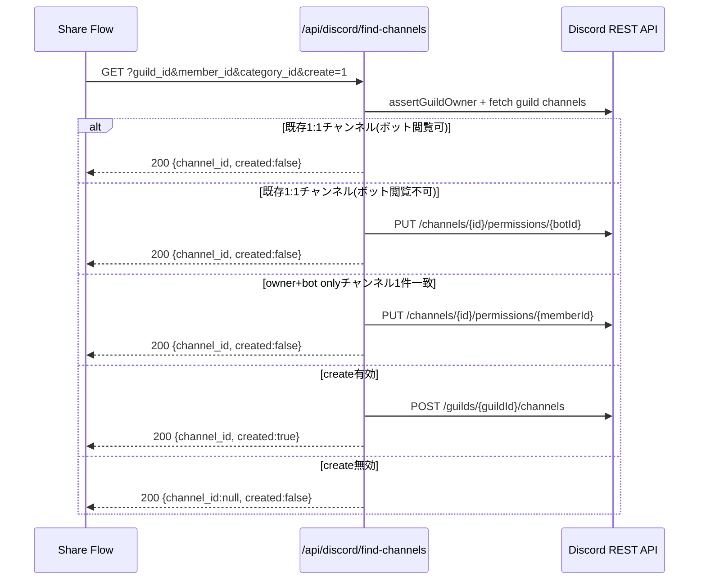
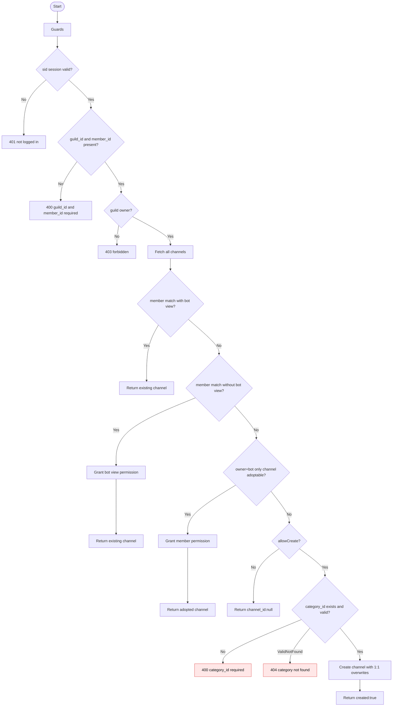

# API仕様書: `GET /api/discord/find-channels`

## Endpoint Summary
- Route: `/api/discord/find-channels`
- Method: `GET`
- Runtime: Node.js API Route
- 主な実装: `apps/web/api/discord/find-channels.js`, `apps/web/api/discord/_lib/giftChannelUtils.js`
- 主な呼び出し元: `apps/web/src/features/discord/sendDiscordShareToMember.ts`, `apps/web/src/modals/dialogs/DiscordMemberPickerDialog.tsx`, `apps/web/src/modals/dialogs/DiscordPrivateChannelCategoryDialog.tsx`

## Non-IT向け説明
このAPIは、特定メンバー向けの1:1チャンネルを「検索し、必要なら作成」します。  
既存チャンネルを優先し、Bot権限不足なら権限付与、条件が合えば再利用します。  
新規作成が必要な場合のみ、指定カテゴリ配下に作成します。  
業務上は、共有先チャンネルを安定して確保する中核APIです。

## 利用フロー（Flow / 道筋）
| Item | 内容 |
| --- | --- |
| 起点機能/画面 | メンバー共有実行、カテゴリ確認テスト |
| 呼び出しトリガー | 「共有する」またはカテゴリ確定時のチャンネル確保 |
| 前段API/処理 | `members`/`list-gift-channels` で候補把握 |
| 当APIの役割 | 既存再利用・権限補正・新規作成のいずれかを実行 |
| 後段API/処理 | `send` APIでメッセージ送信 |
| 失敗時経路 | `409` でカテゴリ上限回復フローへ遷移 |
| 利用者への見え方 | チャンネル自動確保後に共有メッセージが送られる |

### フロー図（Mermaid: sequence）


### アルゴリズムフロー（Mermaid: flowchart）


## Request

### Query Parameters
| Name | Type | Required | Example | Purpose |
| --- | --- | --- | --- | --- |
| `guild_id` | string | Yes | `123456789012345678` | 対象ギルド |
| `member_id` | string | Yes | `345678901234567890` | 対象メンバー |
| `display_name` | string | No | `山田太郎` | 新規作成時チャンネル名候補 |
| `create` | string | No | `1` / `0` / `false` | 見つからない時に作成するか |
| `category_id` | string | Conditional | `234567890123456789` | 作成時の親カテゴリ |
| `health` | string | No | `1` | ヘルスチェック |

### Request Body
なし

### Request Headers
| Header Name | Required | Example | Purpose | When |
| --- | --- | --- | --- | --- |
| `Origin` | Conditional | `https://shimmy3.com` | 許可オリジン検証 | 常時 |
| `Referer` | Conditional | `https://shimmy3.com/gacha` | Origin補助判定 | 常時 |
| `Host` | Yes | `shimmy3.com` | 自サイト判定補助 | 常時 |
| `Cookie` | Yes | `sid=...; discord_csrf=...` | セッション/CSRF照合 | 常時 |
| `x-csrf-token` | Yes | `<discord_csrf token>` | CSRF照合値 | 常時 |
| `Accept` | No | `application/json` | JSON受信指定 | 常時 |
| `x-forwarded-for` | No | `203.0.113.10` | レート制限識別（インフラ由来） | 常時 |

### Request Cookies
| Cookie Name | Required | Example | Purpose |
| --- | --- | --- | --- |
| `sid` | Yes | `sid=...` | Discordセッション識別 |
| `discord_csrf` | Yes | `discord_csrf=...` | CSRF照合 |

## Response

### Status Codes
| Status | Body Example | Meaning |
| --- | --- | --- |
| `200` | `{ "ok": true, "channel_id": "...", "created": false }` | 既存/採用/作成のいずれか成功 |
| `200` | `{ "ok": true, "channel_id": null, "created": false }` | `create=0` かつ未発見 |
| `400` | `{ "ok": false, "error": "guild_id and member_id required" }` | 必須不足 |
| `400` | `{ "ok": false, "error": "category_id required to create private channel" }` | 作成時カテゴリ不足 |
| `401` | `{ "ok": false, "error": "not logged in" }` | 未ログイン |
| `403` | `{ "ok": false, "error": "forbidden" }` | 権限不足/CSRF/Origin不正 |
| `404` | `{ "ok": false, "errorCode": "discord_unknown_guild" }` | ギルド未到達 |
| `404` | `{ "ok": false, "error": "指定されたカテゴリが見つかりません。" }` | カテゴリ不存在 |
| `405` | `{ "ok": false, "error": "Method Not Allowed" }` | GET以外 |
| `409` | `{ "ok": false, "errorCode": "discord_category_channel_limit_reached" }` | カテゴリ50件上限 |
| `429` | `{ "ok": false, "error": "Too Many Requests" }` | レート制限超過 |
| `500` | `{ "ok": false, "error": "DiscordボットのユーザーIDが設定されていません。" }` | Bot ID未解決 |
| `502` | `{ "ok": false, "error": "discord api request failed" }` | Discord API失敗 |

### Response Headers
| Header Name | Presence | Example | Purpose | When |
| --- | --- | --- | --- | --- |
| `Content-Type` | Usually | `application/json; charset=utf-8` | JSON本文通知 | 通常 |
| `Allow` | Conditional | `GET` | 許可メソッド通知 | `405` |
| `Retry-After` | Conditional | `60` | 再試行待機秒数 | `429` |

### Set-Cookie
なし

## 認証・認可
- Session: 必須（`sid`）
- CSRF: 必須（`discord_csrf` Cookie + `x-csrf-token` ヘッダー）
- Origin check: 有効
- Rate limit: `discord:find-channels`, `30 requests / 60 sec`
- 追加認可: `assertGuildOwner` によるギルドオーナー検証

## エラーと利用者影響
| Error Case | User Impact | Operation Response |
| --- | --- | --- |
| `409` | チャンネル作成が止まる | カテゴリ上限回復フローへ誘導 |
| `404` | 対象ギルド/カテゴリが見つからない | Bot参加・カテゴリ選択を見直し |
| `500` | ボット権限補正できない | 環境設定（Bot ID）確認 |

## 業務影響
このAPIが不安定だと共有処理の自動化が崩れ、手動運用やサポート対応が急増します。

## OpenAPI snippet
```yaml
paths:
  /api/discord/find-channels:
    get:
      summary: Find or create private gift channel for member
      parameters:
        - in: query
          name: guild_id
          required: true
          schema:
            type: string
        - in: query
          name: member_id
          required: true
          schema:
            type: string
        - in: query
          name: category_id
          schema:
            type: string
        - in: query
          name: create
          schema:
            type: string
            enum: ["1", "0", "false"]
        - in: query
          name: display_name
          schema:
            type: string
        - in: header
          name: x-csrf-token
          required: true
          schema:
            type: string
      responses:
        "200":
          description: Channel resolved or created
        "400":
          description: Missing required query values
        "401":
          description: Not logged in
        "403":
          description: Forbidden (origin/csrf/owner)
        "404":
          description: Unknown guild or category not found
        "405":
          description: Method Not Allowed
        "409":
          description: Category channel limit reached
        "429":
          description: Too Many Requests
        "500":
          description: Bot identity missing
        "502":
          description: Discord API failed
      security:
        - cookieSid: []
          cookieDiscordCsrf: []
```

## 未確認項目
1. owner+bot only採用ロジック（adopt）の実行頻度と効果測定。

## Glossary
- Adopt: 既存チャンネルへ不足権限を追加して再利用する処理。
- Permission overwrite: Discordチャンネル単位の閲覧/送信権限上書き設定。
