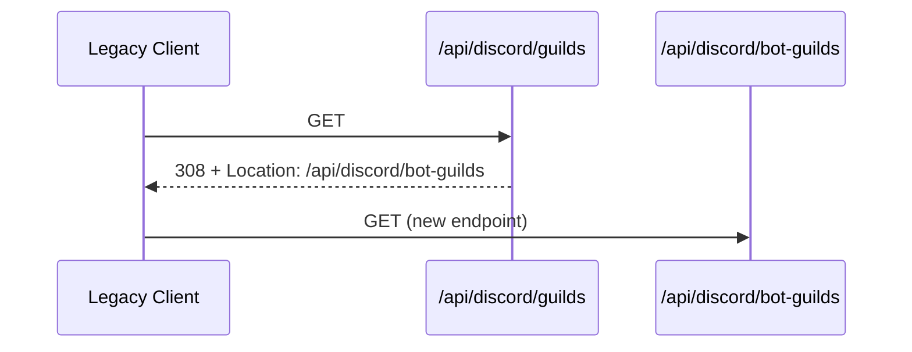

# API仕様書: `GET /api/discord/guilds`（deprecated）

## Endpoint Summary
- Route: `/api/discord/guilds`
- Method: `GET`
- Runtime: Node.js API Route
- 主な実装: `apps/web/api/discord/guilds.js`
- 主な呼び出し元: 現行フロントエンドからの直接呼び出しはなし（旧互換ルート）

## Non-IT向け説明
このAPIは旧URL互換のために残されている「転送専用API」です。  
実処理は新しい `/api/discord/bot-guilds` に統一されています。  
旧URLでアクセスしたクライアントへ、新URLを案内する役割を持ちます。  
業務上は、古いクライアント互換を維持しつつ段階移行するために必要です。

## 利用フロー（Flow / 道筋）
| Item | 内容 |
| --- | --- |
| 起点機能/画面 | 旧クライアントのギルド取得処理 |
| 呼び出しトリガー | 旧URL `/api/discord/guilds` 呼び出し |
| 前段API/処理 | なし |
| 当APIの役割 | 新URLを `Location` とJSON本文で案内 |
| 後段API/処理 | クライアント側で `/api/discord/bot-guilds` を再呼び出し |
| 失敗時経路 | `403`/`429` の場合は移行案内が失敗 |
| 利用者への見え方 | 実質的には自動または手動で新APIへ移行 |

### フロー図（Mermaid: sequence）


## Request

### Query Parameters
| Name | Type | Required | Example | Purpose |
| --- | --- | --- | --- | --- |
| `health` | string | No | `1` | ヘルスチェック |

### Request Body
なし

### Request Headers
| Header Name | Required | Example | Purpose | When |
| --- | --- | --- | --- | --- |
| `Origin` | Conditional | `https://shimmy3.com` | 許可オリジン検証 | 通常 |
| `Referer` | Conditional | `https://shimmy3.com/gacha` | Origin補助判定 | 通常 |
| `Host` | Yes | `shimmy3.com` | 自サイト判定補助 | 常時 |
| `Accept` | No | `application/json` | JSONメッセージ受信 | 通常 |
| `x-forwarded-for` | No | `203.0.113.10` | レート制限識別（インフラ由来） | 通常 |

### Request Cookies
不要

## Response

### Status Codes
| Status | Body Example | Meaning |
| --- | --- | --- |
| `308` | `{ "ok": false, "error":"use /api/discord/bot-guilds", "redirect":"/api/discord/bot-guilds" }` | 新エンドポイントへ恒久的リダイレクト案内 |
| `403` | `{ "ok": false, "error": "Forbidden: origin not allowed" }` | Origin不正 |
| `405` | `{ "ok": false, "error": "Method Not Allowed" }` | GET以外 |
| `429` | `{ "ok": false, "error": "Too Many Requests" }` | レート制限超過 |

### Response Headers
| Header Name | Presence | Example | Purpose | When |
| --- | --- | --- | --- | --- |
| `Location` | Yes (`308`) | `/api/discord/bot-guilds` | 移行先エンドポイント通知 | `308` |
| `Content-Type` | Usually | `application/json; charset=utf-8` | JSON本文通知 | 通常 |
| `Allow` | Conditional | `GET` | 許可メソッド通知 | `405` |
| `Retry-After` | Conditional | `60` | 再試行待機秒数 | `429` |

### Set-Cookie
なし

## 認証・認可
- Session: 不要
- CSRF: 不要
- Origin check: 有効
- Rate limit: `discord:guilds-redirect`, `120 requests / 60 sec`

## エラーと利用者影響
| Error Case | User Impact | Operation Response |
| --- | --- | --- |
| `308` | 一部旧クライアントで再呼び出しが必要 | 新URLへ実装更新 |
| `403` | 旧互換呼び出し不可 | オリジン設定確認 |
| `429` | 一時的にギルド画面へ進めない | 再試行 |

## 業務影響
互換ルートが壊れると旧クライアント利用者の移行中断につながり、問い合わせ増加の原因になります。

## OpenAPI snippet
```yaml
paths:
  /api/discord/guilds:
    get:
      summary: Deprecated redirect endpoint to /api/discord/bot-guilds
      responses:
        "308":
          description: Permanent redirect guidance
          headers:
            Location:
              schema:
                type: string
        "403":
          description: Forbidden (origin)
        "405":
          description: Method Not Allowed
          headers:
            Allow:
              schema:
                type: string
        "429":
          description: Too Many Requests
          headers:
            Retry-After:
              schema:
                type: string
      security: []
```

## 未確認項目
1. 旧クライアントが `308` を自動追従できない場合の残存割合。

## Glossary
- Deprecated endpoint: 新しい手段への移行を前提に維持される旧窓口。
- `308`: メソッドを保持したまま恒久移転を示すHTTPステータス。
