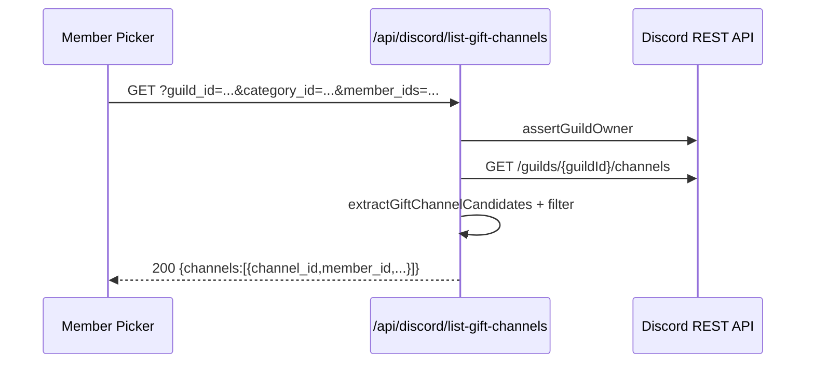
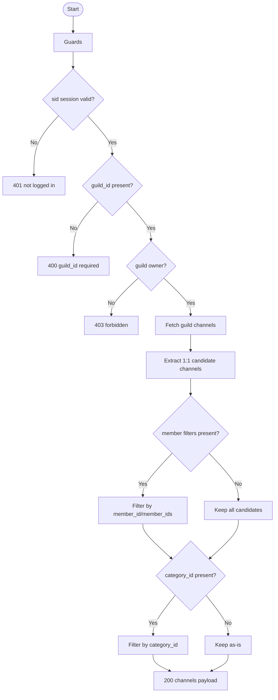

# API仕様書: `GET /api/discord/list-gift-channels`

## Endpoint Summary
- Route: `/api/discord/list-gift-channels`
- Method: `GET`
- Runtime: Node.js API Route
- 主な実装: `apps/web/api/discord/list-gift-channels.js`, `apps/web/api/discord/_lib/giftChannelUtils.js`
- 主な呼び出し元: `apps/web/src/modals/dialogs/DiscordMemberPickerDialog.tsx`, `apps/web/src/modals/dialogs/DiscordBotInviteDialog.tsx`

## Non-IT向け説明
このAPIは「既に作成済みのお渡し専用チャンネル」を一覧化します。  
メンバーIDやカテゴリIDで絞り込みができ、画面で既存リンク先を再利用するために使います。  
内部ではDiscord権限設定を見て、1:1用チャンネルかどうかを判定します。  
業務上は、既存チャンネル再利用により不要なチャンネル増加を抑える役割があります。

## 利用フロー（Flow / 道筋）
| Item | 内容 |
| --- | --- |
| 起点機能/画面 | メンバー選択ダイアログ、ギルド選択直後のキャッシュ更新 |
| 呼び出しトリガー | メンバー一覧取得後に既存お渡しチャンネルを照合 |
| 前段API/処理 | `/api/discord/members` で候補取得済み |
| 当APIの役割 | 1:1候補チャンネルを抽出して返却 |
| 後段API/処理 | UIへ「既存チャンネルあり/なし」を反映 |
| 失敗時経路 | `404`/`502` 時はチャンネル情報を空扱いで継続 |
| 利用者への見え方 | 既存チャンネルがあれば再利用される |

### フロー図（Mermaid: sequence）


### アルゴリズムフロー（Mermaid: flowchart）


## Request

### Query Parameters
| Name | Type | Required | Example | Purpose |
| --- | --- | --- | --- | --- |
| `guild_id` | string | Yes | `123456789012345678` | 対象ギルド |
| `category_id` | string | No | `234567890123456789` | カテゴリ絞り込み |
| `member_id` | string or array | No | `345...` / `345...,678...` | 1件または複数メンバー絞り込み |
| `member_ids` | string or array | No | `345...,678...` | 複数メンバー絞り込み |
| `health` | string | No | `1` | ヘルスチェック |

### Request Body
なし

### Request Headers
| Header Name | Required | Example | Purpose | When |
| --- | --- | --- | --- | --- |
| `Origin` | Conditional | `https://shimmy3.com` | 許可オリジン検証 | 常時 |
| `Referer` | Conditional | `https://shimmy3.com/gacha` | Origin補助判定 | 常時 |
| `Host` | Yes | `shimmy3.com` | 自サイト判定補助 | 常時 |
| `Cookie` | Yes | `sid=...; discord_csrf=...` | セッション/CSRF照合 | 常時 |
| `x-csrf-token` | Yes | `<discord_csrf token>` | CSRF照合値 | 常時 |
| `Accept` | No | `application/json` | JSON受信指定 | 常時 |
| `x-forwarded-for` | No | `203.0.113.10` | レート制限識別（インフラ由来） | 常時 |

### Request Cookies
| Cookie Name | Required | Example | Purpose |
| --- | --- | --- | --- |
| `sid` | Yes | `sid=...` | Discordセッション識別 |
| `discord_csrf` | Yes | `discord_csrf=...` | CSRF照合 |

## Response

### Status Codes
| Status | Body Example | Meaning |
| --- | --- | --- |
| `200` | `{ "ok": true, "channels": [{"channel_id":"...","member_id":"..."}] }` | 抽出成功 |
| `400` | `{ "ok": false, "error": "guild_id required" }` | 必須不足 |
| `401` | `{ "ok": false, "error": "not logged in" }` | 未ログイン |
| `403` | `{ "ok": false, "error": "forbidden" }` | 権限不足/CSRF/Origin不正 |
| `404` | `{ "ok": false, "errorCode":"discord_unknown_guild" }` | ギルド未到達 |
| `405` | `{ "ok": false, "error": "Method Not Allowed" }` | GET以外 |
| `429` | `{ "ok": false, "error": "Too Many Requests" }` | レート制限超過 |
| `502` | `{ "ok": false, "error": "discord api request failed" }` | Discord API失敗 |

### Response Headers
| Header Name | Presence | Example | Purpose | When |
| --- | --- | --- | --- | --- |
| `Content-Type` | Usually | `application/json; charset=utf-8` | JSON本文通知 | 通常 |
| `Allow` | Conditional | `GET` | 許可メソッド通知 | `405` |
| `Retry-After` | Conditional | `60` | 再試行待機秒数 | `429` |

### Set-Cookie
なし

## 認証・認可
- Session: 必須（`sid`）
- CSRF: 必須（`discord_csrf` Cookie + `x-csrf-token` ヘッダー）
- Origin check: 有効
- Rate limit: `discord:list-gift-channels`, `30 requests / 60 sec`
- 追加認可: `assertGuildOwner` によるギルドオーナー検証

## エラーと利用者影響
| Error Case | User Impact | Operation Response |
| --- | --- | --- |
| `404` | 既存チャンネル判定ができない | Bot参加状態を確認 |
| `502` | チャンネル情報が空になる | 新規作成フローへフォールバック |

## 業務影響
既存チャンネルを再利用できないと、チャンネル乱立・管理負荷増加・誤案内のリスクが上がります。

## OpenAPI snippet
```yaml
paths:
  /api/discord/list-gift-channels:
    get:
      summary: List existing private gift channels
      parameters:
        - in: query
          name: guild_id
          required: true
          schema:
            type: string
        - in: query
          name: category_id
          schema:
            type: string
        - in: query
          name: member_ids
          schema:
            type: string
        - in: header
          name: x-csrf-token
          required: true
          schema:
            type: string
      responses:
        "200":
          description: Gift channels resolved
        "400":
          description: Missing guild_id
        "401":
          description: Not logged in
        "403":
          description: Forbidden (origin/csrf/owner)
        "404":
          description: Unknown guild
        "405":
          description: Method Not Allowed
        "429":
          description: Too Many Requests
        "502":
          description: Discord API failed
      security:
        - cookieSid: []
          cookieDiscordCsrf: []
```

## 未確認項目
1. `member_id` と `member_ids` を同時指定したときの実運用利用率。

## Glossary
- Gift channel: 本プロダクトで「お渡し専用」として使うDiscordテキストチャンネル。
- Candidate extraction: 権限上書き条件を満たすチャンネルだけを抽出する処理。
