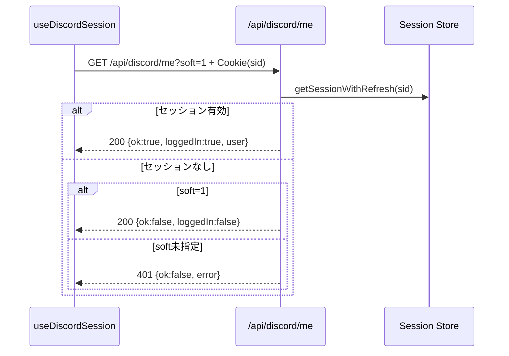
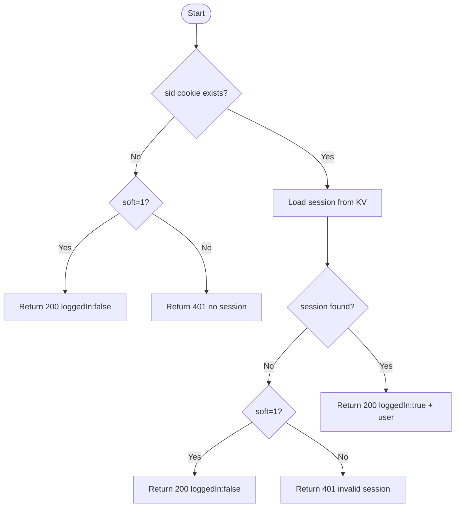

# API仕様書: `GET /api/discord/me`

## Endpoint Summary
- Route: `/api/discord/me`
- Method: `GET`
- Runtime: Node.js API Route
- 主な実装: `apps/web/api/discord/me.js`
- 主な呼び出し元: `apps/web/src/features/discord/useDiscordSession.ts` (`fetchSession()`)

## Non-IT向け説明
このAPIは「現在ログイン中のDiscordユーザー情報」を確認するためのAPIです。  
画面側はこの結果を使って、ログイン済み表示や利用可能機能の切り替えを行います。  
`soft=1` を付けると、未ログインでもエラーではなく「未ログイン状態」を返します。  
業務上は、ログイン判定が誤ると連携機能の導線が崩れるため重要です。

## 利用フロー（Flow / 道筋）
| Item | 内容 |
| --- | --- |
| 起点機能/画面 | 画面表示時のDiscordセッション確認 |
| 呼び出しトリガー | `useDiscordSession` の初期取得/再取得 |
| 前段API/処理 | ブラウザが `sid` Cookie を送信 |
| 当APIの役割 | `sid` からセッションを引き当て、ログイン可否を返す |
| 後段API/処理 | UIがログイン済み表示/未ログイン表示を分岐 |
| 失敗時経路 | `401` の場合は未ログイン扱い、`429` は再試行 |
| 利用者への見え方 | ログイン状態が正しく反映される |

### フロー図（Mermaid: sequence）


### アルゴリズムフロー（Mermaid: flowchart）


## Request

### Query Parameters
| Name | Type | Required | Example | Purpose |
| --- | --- | --- | --- | --- |
| `soft` | string | No | `1` | 未ログイン時を200応答にする |
| `health` | string | No | `1` | ヘルスチェック |

### Request Body
なし

### Request Headers
| Header Name | Required | Example | Purpose | When |
| --- | --- | --- | --- | --- |
| `Origin` | Conditional | `https://shimmy3.com` | 許可オリジン検証 | 通常 |
| `Referer` | Conditional | `https://shimmy3.com/gacha` | Origin欠落時の補助判定 | 通常 |
| `Host` | Yes | `shimmy3.com` | 自サイト判定補助 | 常時 |
| `Cookie` | Yes | `sid=<session-id>` | セッション識別子送信 | 常時 |
| `Accept` | No | `application/json` | JSON受信指定 | 通常 |
| `x-forwarded-for` | No | `203.0.113.10` | レート制限の識別補助（インフラ由来） | 通常 |

### Request Cookies
| Cookie Name | Required | Example | Purpose |
| --- | --- | --- | --- |
| `sid` | Yes | `sid=...` | Discord連携セッション識別 |

## Response

### Status Codes
| Status | Body Example | Meaning |
| --- | --- | --- |
| `200` | `{ "ok": true, "loggedIn": true, "user": {"id":"..."} }` | セッション有効 |
| `200` | `{ "ok": false, "loggedIn": false }` | `soft=1` で未ログイン |
| `401` | `{ "ok": false, "error": "no session" }` | セッション未送信/無効 |
| `403` | `{ "ok": false, "error": "Forbidden: origin not allowed" }` | Origin不正 |
| `405` | `{ "ok": false, "error": "Method Not Allowed" }` | GET以外 |
| `429` | `{ "ok": false, "error": "Too Many Requests" }` | レート制限超過 |

### Response Headers
| Header Name | Presence | Example | Purpose | When |
| --- | --- | --- | --- | --- |
| `Content-Type` | Usually | `application/json; charset=utf-8` | JSON本文の通知 | 通常 |
| `Allow` | Conditional | `GET` | 許可メソッド通知 | `405` |
| `Retry-After` | Conditional | `60` | 再試行待機秒数 | `429` |

### Set-Cookie
なし

## 認証・認可
- Session: 必須（`sid`）
- CSRF: 不要
- Origin check: 有効
- Rate limit: `discord:me`, `120 requests / 60 sec`

## エラーと利用者影響
| Error Case | User Impact | Operation Response |
| --- | --- | --- |
| `401` | Discord連携情報が表示されない | 再ログイン導線を案内 |
| `403` | 一部環境で取得不可 | 許可オリジン設定を確認 |
| `429` | 一時的に状態更新が遅れる | 時間を空けて再試行 |

## 業務影響
ログイン判定ができないとDiscord共有導線全体が停止し、操作サポート工数が増えます。

## OpenAPI snippet
```yaml
paths:
  /api/discord/me:
    get:
      summary: Get current Discord session state
      parameters:
        - in: query
          name: soft
          schema:
            type: string
            enum: ["1"]
        - in: header
          name: Origin
          schema:
            type: string
        - in: header
          name: Referer
          schema:
            type: string
      responses:
        "200":
          description: Session resolved (logged-in or soft not-logged-in)
        "401":
          description: Session missing or invalid
        "403":
          description: Forbidden (origin)
        "405":
          description: Method Not Allowed
          headers:
            Allow:
              schema:
                type: string
        "429":
          description: Too Many Requests
          headers:
            Retry-After:
              schema:
                type: string
      security:
        - cookieSid: []
```

## 未確認項目
1. `soft` 未指定時の利用比率（運用観点）。

## Glossary
- Session: ログイン状態をサーバー側で保持する仕組み。
- KV: Key-Value形式でデータを保存するストア（ここではセッション保存先）。
