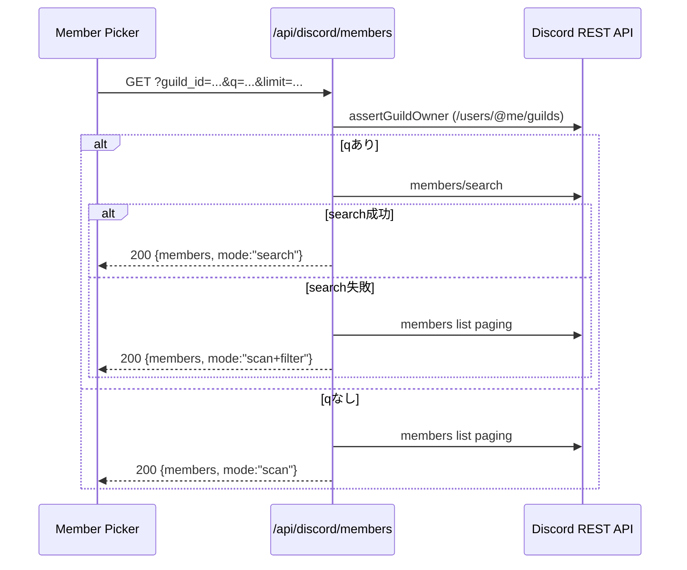
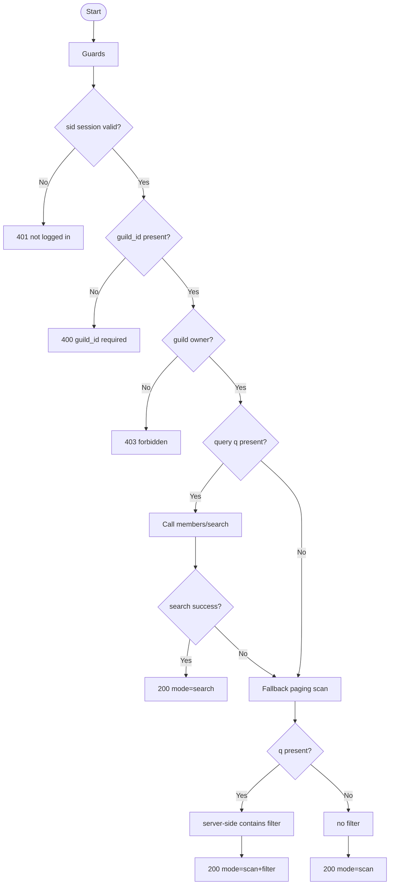

# API仕様書: `GET /api/discord/members`

## Endpoint Summary
- Route: `/api/discord/members`
- Method: `GET`
- Runtime: Node.js API Route
- 主な実装: `apps/web/api/discord/members.js`
- 主な呼び出し元: `apps/web/src/modals/dialogs/DiscordMemberPickerDialog.tsx`, `apps/web/src/modals/dialogs/DiscordBotInviteDialog.tsx`

## Non-IT向け説明
このAPIは、共有先に選ぶDiscordメンバー一覧を取得します。  
検索語がある場合はDiscord検索APIを使い、失敗時は一覧走査に切り替える設計です。  
利用者はこの結果から「誰に共有するか」を選択します。  
業務上は、メンバー候補の欠落や重複が共有ミスに直結します。

## 利用フロー（Flow / 道筋）
| Item | 内容 |
| --- | --- |
| 起点機能/画面 | メンバー選択ダイアログ |
| 呼び出しトリガー | ダイアログ表示、検索文字入力、ギルド切替 |
| 前段API/処理 | `/api/discord/csrf` でトークン取得済み |
| 当APIの役割 | ギルドメンバー一覧（または検索結果）を返す |
| 後段API/処理 | UIでメンバー一覧描画し、共有相手選択へ進む |
| 失敗時経路 | `403/404/502` 時に警告表示 |
| 利用者への見え方 | 候補一覧が表示され、検索可否が切替わる |

### フロー図（Mermaid: sequence）


### アルゴリズムフロー（Mermaid: flowchart）


## Request

### Query Parameters
| Name | Type | Required | Example | Purpose |
| --- | --- | --- | --- | --- |
| `guild_id` | string | Yes | `123456789012345678` | 対象ギルド |
| `q` | string | No | `shimmy` | メンバー検索語 |
| `limit` | number | No | `200` | 最大件数（実装上限1000） |
| `health` | string | No | `1` | ヘルスチェック |

### Request Body
なし

### Request Headers
| Header Name | Required | Example | Purpose | When |
| --- | --- | --- | --- | --- |
| `Origin` | Conditional | `https://shimmy3.com` | 許可オリジン検証 | 常時 |
| `Referer` | Conditional | `https://shimmy3.com/gacha` | Origin補助判定 | 常時 |
| `Host` | Yes | `shimmy3.com` | 自サイト判定補助 | 常時 |
| `Cookie` | Yes | `sid=...; discord_csrf=...` | セッション/CSRF照合 | 常時 |
| `x-csrf-token` | Yes | `<discord_csrf token>` | CSRF照合値 | 常時 |
| `Accept` | No | `application/json` | JSON受信指定 | 常時 |
| `x-forwarded-for` | No | `203.0.113.10` | レート制限識別（インフラ由来） | 常時 |

### Request Cookies
| Cookie Name | Required | Example | Purpose |
| --- | --- | --- | --- |
| `sid` | Yes | `sid=...` | Discordセッション識別 |
| `discord_csrf` | Yes | `discord_csrf=...` | `x-csrf-token` 照合用 |

## Response

### Status Codes
| Status | Body Example | Meaning |
| --- | --- | --- |
| `200` | `{ "ok": true, "members": [...], "mode": "search" }` | 取得成功 |
| `400` | `{ "ok": false, "error": "guild_id required" }` | 必須不足 |
| `401` | `{ "ok": false, "error": "not logged in" }` | 未ログイン |
| `403` | `{ "ok": false, "error": "forbidden" }` | オーナー権限不足/CSRF/Origin不正 |
| `404` | `{ "ok": false, "errorCode": "discord_unknown_guild" }` | ギルド未到達 |
| `405` | `{ "ok": false, "error": "Method Not Allowed" }` | GET以外 |
| `429` | `{ "ok": false, "error": "Too Many Requests" }` | レート制限超過 |
| `502` | `{ "ok": false, "error": "discord api request failed" }` | Discord API失敗 |

### Response Headers
| Header Name | Presence | Example | Purpose | When |
| --- | --- | --- | --- | --- |
| `Content-Type` | Usually | `application/json; charset=utf-8` | JSON本文通知 | 通常 |
| `Allow` | Conditional | `GET` | 許可メソッド通知 | `405` |
| `Retry-After` | Conditional | `60` | 再試行待機秒数 | `429` |

### Set-Cookie
なし

## 認証・認可
- Session: 必須（`sid`）
- CSRF: 必須（`discord_csrf` Cookie + `x-csrf-token` ヘッダー）
- Origin check: 有効
- Rate limit: `discord:members`, `20 requests / 60 sec`
- 追加認可: `assertGuildOwner` によるギルドオーナー検証

## エラーと利用者影響
| Error Case | User Impact | Operation Response |
| --- | --- | --- |
| `403` | メンバーを取得できない | 権限/CSRF/オリジンを確認 |
| `404` | ギルドにアクセスできない | Bot参加と権限設定確認 |
| `502` | 一時的に候補一覧が空になる | 再試行導線を案内 |

## 業務影響
メンバー一覧が不正確だと誤送信や再送対応が増え、運用効率が下がります。

## OpenAPI snippet
```yaml
paths:
  /api/discord/members:
    get:
      summary: Resolve guild members for picker/search
      parameters:
        - in: query
          name: guild_id
          required: true
          schema:
            type: string
        - in: query
          name: q
          schema:
            type: string
        - in: query
          name: limit
          schema:
            type: integer
            minimum: 1
            maximum: 1000
        - in: header
          name: x-csrf-token
          required: true
          schema:
            type: string
      responses:
        "200":
          description: Members resolved
        "400":
          description: Missing guild_id
        "401":
          description: Not logged in
        "403":
          description: Forbidden (origin/csrf/owner)
        "404":
          description: Unknown guild
        "405":
          description: Method Not Allowed
        "429":
          description: Too Many Requests
        "502":
          description: Discord API failed
      security:
        - cookieSid: []
          cookieDiscordCsrf: []
```

## 未確認項目
1. `mode=scan+filter` が発生した割合（Discord検索失敗率）の定量。

## Glossary
- Paging: 一度に全件取らず、分割して順次取得する方式。
- Fallback: 第1手段が失敗したときに第2手段へ切替える処理。
