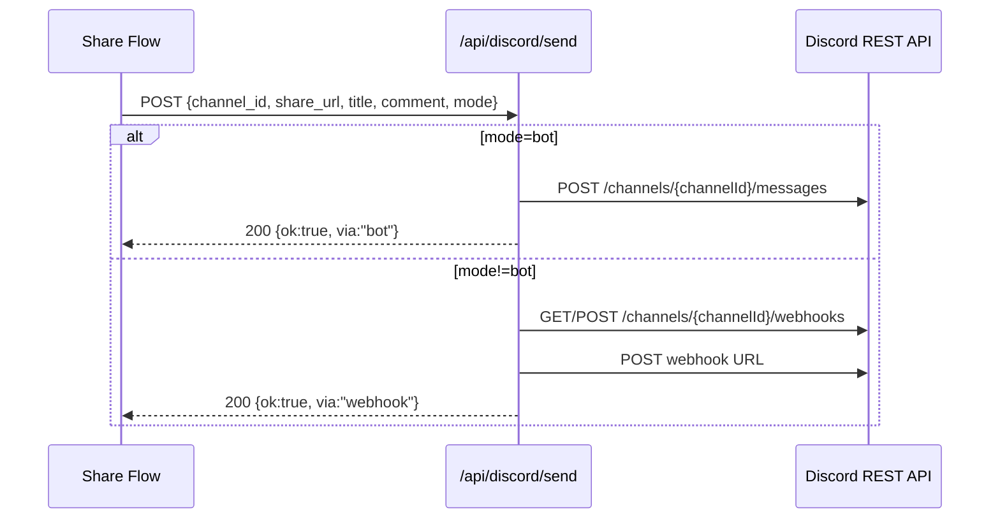
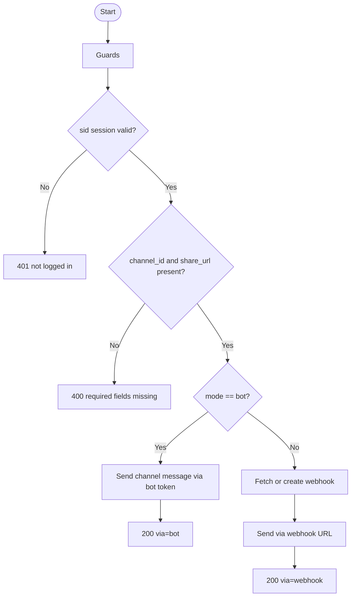

# API仕様書: `POST /api/discord/send`

## Endpoint Summary
- Route: `/api/discord/send`
- Method: `POST`
- Runtime: Node.js API Route
- 主な実装: `apps/web/api/discord/send.js`
- 主な呼び出し元: `apps/web/src/features/discord/sendDiscordShareToMember.ts`, `apps/web/src/modals/dialogs/DiscordMemberPickerDialog.tsx`, `apps/web/src/modals/dialogs/DiscordPrivateChannelCategoryDialog.tsx`

## Non-IT向け説明
このAPIは、Discordチャンネルへ共有メッセージを送信します。  
通常はBot投稿モードで動き、必要に応じてWebhookモードも使えます。  
本文にはタイトル・共有URL・補足コメントを連結して送ります。  
業務上は、共有情報が利用者へ届く最終工程であり、失敗すると受け取り不能につながります。

## 利用フロー（Flow / 道筋）
| Item | 内容 |
| --- | --- |
| 起点機能/画面 | メンバー共有実行、カテゴリテスト送信 |
| 呼び出しトリガー | `find-channels` 後に送信実行 |
| 前段API/処理 | `/api/discord/find-channels` で `channel_id` 確保 |
| 当APIの役割 | Discordへ本文送信（BotまたはWebhook） |
| 後段API/処理 | 画面に送信完了を反映 |
| 失敗時経路 | エラー表示して再送または設定確認 |
| 利用者への見え方 | 正常時はDiscordに共有メッセージが到着 |

### フロー図（Mermaid: sequence）


### アルゴリズムフロー（Mermaid: flowchart）


## Request

### Query Parameters
なし（`health` は未対応）

### Request Body
| Name | Type | Required | Example | Purpose |
| --- | --- | --- | --- | --- |
| `channel_id` | string | Yes | `456789012345678901` | 送信先チャンネル |
| `share_url` | string | Yes | `https://shimmy3.com/receive?t=...` | 共有URL |
| `title` | string | No | `景品リンクです` | 本文1行目タイトル |
| `comment` | string | No | `受け取りお願いします` | 補足コメント |
| `mode` | string | No | `bot` / `webhook` | 投稿方式（既定: `bot`） |

### Request Headers
| Header Name | Required | Example | Purpose | When |
| --- | --- | --- | --- | --- |
| `Origin` | Conditional | `https://shimmy3.com` | 許可オリジン検証 | 常時 |
| `Referer` | Conditional | `https://shimmy3.com/gacha` | Origin補助判定 | 常時 |
| `Host` | Yes | `shimmy3.com` | 自サイト判定補助 | 常時 |
| `Cookie` | Yes | `sid=...; discord_csrf=...` | セッション/CSRF照合 | 常時 |
| `x-csrf-token` | Yes | `<discord_csrf token>` | CSRF照合値 | 常時 |
| `Content-Type` | Yes | `application/json` | JSON本文送信 | 常時 |
| `Accept` | No | `application/json` | JSON受信指定 | 常時 |
| `x-forwarded-for` | No | `203.0.113.10` | レート制限識別（インフラ由来） | 常時 |

### Request Cookies
| Cookie Name | Required | Example | Purpose |
| --- | --- | --- | --- |
| `sid` | Yes | `sid=...` | Discordセッション識別 |
| `discord_csrf` | Yes | `discord_csrf=...` | CSRF照合 |

## Response

### Status Codes
| Status | Body Example | Meaning |
| --- | --- | --- |
| `200` | `{ "ok": true, "message_id": "...", "via": "bot" }` | 送信成功 |
| `400` | `{ "ok": false, "error": "channel_id and share_url required" }` | 必須不足 |
| `401` | `{ "ok": false, "error": "not logged in" }` | 未ログイン |
| `403` | `{ "ok": false, "error": "Forbidden: invalid CSRF token" }` | CSRF/Origin不正 |
| `405` | `{ "ok": false, "error": "Method Not Allowed" }` | POST以外 |
| `429` | `{ "ok": false, "error": "Too Many Requests" }` | レート制限超過 |
| `500` | `{ "ok": false, "error": "..." }` | Discord送信失敗など未捕捉例外 |

### Response Headers
| Header Name | Presence | Example | Purpose | When |
| --- | --- | --- | --- | --- |
| `Content-Type` | Usually | `application/json; charset=utf-8` | JSON本文通知 | 通常 |
| `Allow` | Conditional | `POST` | 許可メソッド通知 | `405` |
| `Retry-After` | Conditional | `60` | 再試行待機秒数 | `429` |

### Set-Cookie
なし

## 認証・認可
- Session: 必須（`sid`）
- CSRF: 必須（`discord_csrf` Cookie + `x-csrf-token` ヘッダー）
- Origin check: 有効
- Rate limit: `discord:send`, `20 requests / 60 sec`
- 注意: 実装上、このAPI単体では guild owner の追加検証は行わない

## エラーと利用者影響
| Error Case | User Impact | Operation Response |
| --- | --- | --- |
| `400` | 共有送信できない | 入力値（URL/チャンネルID）を再確認 |
| `500` | Discordに投稿されない | 再送、Bot権限やWebhook確認 |
| `429` | 連続送信が一時停止 | 待機して再試行 |

## 業務影響
最終送信に失敗すると、利用者はリンクを受け取れず、配布業務が完了しません。

## OpenAPI snippet
```yaml
paths:
  /api/discord/send:
    post:
      summary: Send share message to Discord channel
      parameters:
        - in: header
          name: x-csrf-token
          required: true
          schema:
            type: string
      requestBody:
        required: true
        content:
          application/json:
            schema:
              type: object
              required: [channel_id, share_url]
              properties:
                channel_id:
                  type: string
                share_url:
                  type: string
                title:
                  type: string
                comment:
                  type: string
                mode:
                  type: string
                  enum: [bot, webhook]
      responses:
        "200":
          description: Message sent
        "400":
          description: Missing required fields
        "401":
          description: Not logged in
        "403":
          description: Forbidden (origin/csrf)
        "405":
          description: Method Not Allowed
        "429":
          description: Too Many Requests
        "500":
          description: Discord send failure
      security:
        - cookieSid: []
          cookieDiscordCsrf: []
```

## 未確認項目
1. `mode=webhook` 利用時の監査ログ運用方針。

## Glossary
- Webhook: 外部URLへHTTP送信する形でメッセージ投稿を行う仕組み。
- Message ID: Discord側で発行される投稿識別子。
