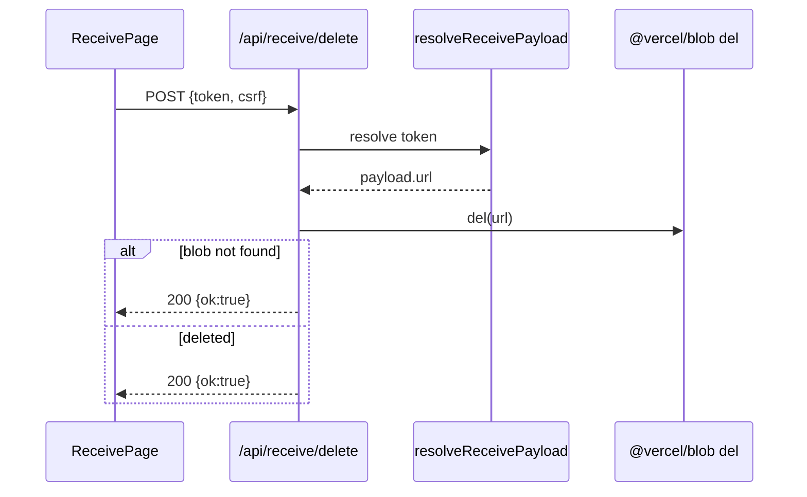

# API仕様書: `POST /api/receive/delete`

## Endpoint Summary
- Route: `/api/receive/delete`
- Method: `POST`
- Runtime: Node.js API Route
- 主な実装: `apps/web/api/receive/delete.js`
- 主な呼び出し元: `apps/web/src/pages/receive/ReceivePage.tsx` (`handleCleanupBlob()`)

## Non-IT向け説明
このAPIは受け取りリンクに紐づく元ファイルを削除します。  
受け取り後のクリーンアップ操作で使い、不要データの残存を減らします。  
削除対象はトークン解決結果に基づいて決まり、許可されないURLは拒否されます。  
業務上はストレージ整理と誤配布防止に役立ちます。

## 利用フロー（Flow / 道筋）
| Item | 内容 |
| --- | --- |
| 起点機能/画面 | 受け取りページの「削除」操作 |
| 呼び出しトリガー | `handleCleanupBlob()` 実行 |
| 前段API/処理 | `/api/blob/csrf` 取得、対象token確定 |
| 当APIの役割 | token解決してBlobファイルを削除 |
| 後段API/処理 | UI履歴に `deletedAt` 反映 |
| 失敗時経路 | token不正や設定不備なら削除中断 |
| 利用者への見え方 | 成功で削除完了表示、失敗でエラーメッセージ |

### フロー図（Mermaid: sequence）


### アルゴリズムフロー
該当なし（単純処理）。  
主処理は「token解決 -> Blob削除実行 -> 成否返却」で、複雑な反復アルゴリズムはありません。

## Request

### Request Body
| Name | Type | Required | Example | Purpose |
| --- | --- | --- | --- | --- |
| `token` | string | Conditional | `AbCd...` | 削除対象トークン（body優先） |
| `csrf` | string | Yes | `...` | CSRF照合 |

### Query Parameters
| Name | Type | Required | Example | Purpose |
| --- | --- | --- | --- | --- |
| `t` | string | Conditional | `AbCd...` | body未指定時のtoken代替 |

### Request Headers
| Header Name | Required | Purpose |
| --- | --- | --- |
| `Content-Type` | Yes | JSON解析 |
| `Cookie` | Yes | `csrf` 照合 |
| `Origin` | Conditional | 同一オリジン検証 |

### Request Cookies
| Cookie Name | Required | Purpose |
| --- | --- | --- |
| `csrf` | Yes | body `csrf` と一致確認 |

## Response

### Status Codes
| Status | Body Example | Meaning |
| --- | --- | --- |
| `200` | `{ "ok": true }` | 削除成功（Blob 404も成功扱い） |
| `400` | `{ "ok": false, "error":"...", "code":"..." }` | token形式不正 |
| `403` | `{ "ok": false, "error":"Forbidden: ..." }` | CSRF/Origin失敗 |
| `404` | `{ "ok": false, "error":"Not Found: token not found", "code":"TOKEN_NOT_FOUND" }` | token不在 |
| `410` | `{ "ok": false, "error":"Link expired", "code":"EXPIRED" }` | 期限切れ |
| `429` | `{ "ok": false, "error":"Too Many Requests" }` | レート制限 |
| `500` | `{ "ok": false, "error":"Server configuration error" }` | Blob設定不足など |

### Response Headers
| Header Name | Presence | Example | Purpose |
| --- | --- | --- | --- |
| `Content-Type` | Usually | `application/json; charset=utf-8` | JSON通知 |
| `Retry-After` | Conditional | `60` | レート制限待機 |
| `Allow` | Conditional | `POST` | メソッド制約 |

### Set-Cookie
なし

## 認証・認可
- Session: 必須ではない
- CSRF: 必須
- Origin check: 有効
- Rate limit: `receive:delete`, `10 requests / 60 sec`

## エラーと利用者影響
| Error Case | User Impact | Operation Response |
| --- | --- | --- |
| `403` | 削除操作不可 | CSRF再取得・オリジン確認 |
| `404/410` | 既に無効なリンクで削除不可 | 履歴整合を確認 |
| `500` | 削除結果不明 | 時間を置いて再試行 |

## 業務影響
削除機能が不安定だと不要ファイルが残り、運用コストと情報管理リスクが増えます。

## OpenAPI snippet
```yaml
paths:
  /api/receive/delete:
    post:
      summary: Delete blob file resolved by receive token
      requestBody:
        required: true
        content:
          application/json:
            schema:
              type: object
              required: [csrf]
              properties:
                token:
                  type: string
                csrf:
                  type: string
      responses:
        "200":
          description: Delete handled
        "400":
          description: Bad Request
        "403":
          description: Forbidden
        "404":
          description: Token not found
        "410":
          description: Token expired
        "429":
          description: Too Many Requests
        "500":
          description: Internal Server Error
      security: []
```

## 未確認項目
1. 削除実行結果の監査ログ連携方針。

## Glossary
- Cleanup: 受け取り完了後に関連ファイルを整理する操作。
- Blob: Vercel Blob上の保存ファイル。
