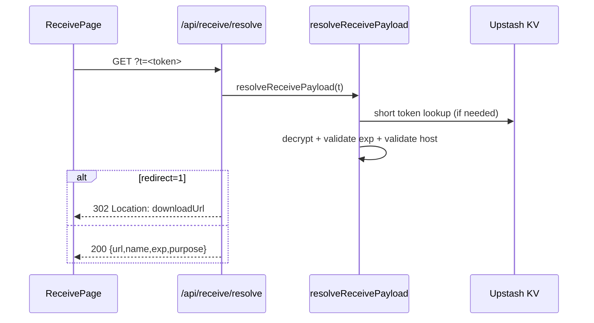
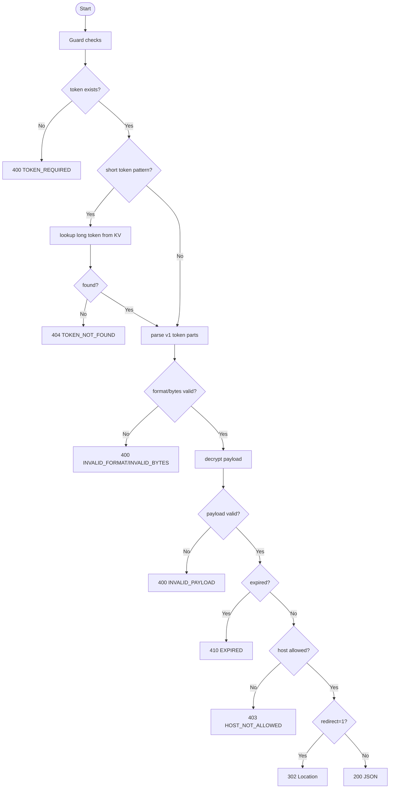

# API仕様書: `GET /api/receive/resolve`

## Endpoint Summary
- Route: `/api/receive/resolve`
- Method: `GET`
- Runtime: Node.js API Route
- 主な実装: `apps/web/api/receive/resolve.js`, `apps/web/api/_lib/receiveToken.js`
- 主な呼び出し元: `apps/web/src/pages/receive/ReceivePage.tsx` (`resolveReceiveToken()`)

## Non-IT向け説明
このAPIは共有トークンを実際の受け取り先URLへ変換します。  
短縮トークンでも暗号化トークンでも受け付け、期限や保存先の妥当性を確認します。  
必要に応じてJSON返却か直接リダイレクトを選べます。  
業務上は受け取り体験の安定性を決める重要APIです。

## 利用フロー（Flow / 道筋）
| Item | 内容 |
| --- | --- |
| 起点機能/画面 | 受け取りページでトークン入力 or URL遷移 |
| 呼び出しトリガー | `ReceivePage` が token を解決 |
| 前段API/処理 | `/api/receive/token` で発行済み |
| 当APIの役割 | トークン解決・期限確認・ホスト許可確認 |
| 後段API/処理 | JSON応答なら画面表示、`redirect=1` ならダウンロード遷移 |
| 失敗時経路 | `410` 期限切れ、`404` 不在、`403` ホスト不許可 |
| 利用者への見え方 | 正常なら受け取り可能、失敗なら理由別メッセージ |

### フロー図（Mermaid: sequence）


### アルゴリズムフロー（Mermaid: flowchart）


## Request

### Query Parameters
| Name | Type | Required | Example | Purpose |
| --- | --- | --- | --- | --- |
| `t` | string | Yes | `AbCdEf...` | 解決対象トークン |
| `redirect` | string | No | `1` | 直接ダウンロード先へ遷移 |
| `health` | string | No | `1` | ヘルスチェック |

### Request Headers
| Header Name | Required | Purpose |
| --- | --- | --- |
| `Origin` | Conditional | 同一オリジン判定 |
| `Referer` | Conditional | Origin補助判定 |
| `Host` | Yes | 自サイト判定補助 |

### Request Cookies
不要

## Response

### Status Codes
| Status | Body Example | Meaning |
| --- | --- | --- |
| `200` | `{ "ok": true, "url":"...", "name":"...", "exp":..., "purpose":"..." }` | 解決成功 |
| `302` | なし（Location） | 直接ダウンロード遷移 |
| `400` | `{ "ok": false, "code":"TOKEN_REQUIRED" ... }` | 形式不正/必須不足 |
| `403` | `{ "ok": false, "code":"HOST_NOT_ALLOWED" ... }` | ホスト不許可 |
| `404` | `{ "ok": false, "code":"TOKEN_NOT_FOUND" ... }` | トークン不在 |
| `410` | `{ "ok": false, "code":"EXPIRED", "exp":... }` | 期限切れ |
| `429` | `{ "ok": false, "error":"Too Many Requests" }` | レート制限 |
| `500` | `{ "ok": false, "error":"..." }` | 内部エラー |

### Response Headers
| Header Name | Presence | Example | Purpose |
| --- | --- | --- | --- |
| `Location` | Conditional | `https://...blob.vercel-storage.com/...` | ダウンロード先遷移 |
| `Content-Type` | Usually | `application/json; charset=utf-8` | JSON通知 |
| `Retry-After` | Conditional | `60` | 待機秒数 |
| `Allow` | Conditional | `GET` | メソッド制約 |

### Set-Cookie
なし

## 認証・認可
- Session: 不要
- CSRF: 不要
- Origin check: 有効
- Rate limit: `receive:resolve`, `120 requests / 60 sec`

## エラーと利用者影響
| Error Case | User Impact | Operation Response |
| --- | --- | --- |
| `404` | 受け取りIDが無効 | 入力確認・再発行依頼 |
| `410` | 期限切れで受け取れない | 配信者に再発行依頼 |
| `403` | 保存先不許可で受け取れない | 運用設定確認 |
| `500` | 一時的に受け取れない | 再試行 |

## 業務影響
このAPIの誤動作は受け取り不能として即時顕在化し、サポート問い合わせ増加につながります。

## OpenAPI snippet
```yaml
paths:
  /api/receive/resolve:
    get:
      summary: Resolve receive token to download URL
      parameters:
        - in: query
          name: t
          required: true
          schema:
            type: string
        - in: query
          name: redirect
          schema:
            type: string
            enum: ["1"]
      responses:
        "200":
          description: Token resolved
        "302":
          description: Redirect to download URL
          headers:
            Location:
              schema:
                type: string
        "400":
          description: Invalid token
        "403":
          description: Host not allowed
        "404":
          description: Token not found
        "410":
          description: Token expired
        "429":
          description: Too Many Requests
        "500":
          description: Internal Server Error
      security: []
```

## 未確認項目
1. `redirect=1` 使用時のブラウザ別ダウンロードUX差異。

## Glossary
- Resolve: トークンから実体情報（URLなど）を復元する処理。
- Token payload: 暗号化されているURL/期限/メタ情報。
