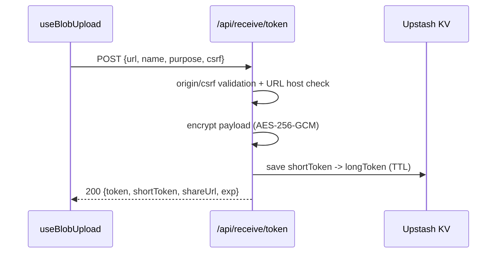

# API仕様書: `POST /api/receive/token`

## Endpoint Summary
- Route: `/api/receive/token`
- Method: `POST`
- Runtime: Node.js API Route
- 主な実装: `apps/web/api/receive/token.js`
- 主な呼び出し元: `apps/web/src/features/save/useBlobUpload.ts` (`issueReceiveShareUrl()`)

## Non-IT向け説明
このAPIは、アップロード済みファイルのダウンロードURLを共有用トークンへ変換するAPIです。  
実URLをそのまま配布せず、短い受け取りURLに変換することで取り扱いを簡単にします。  
トークン内部は暗号化され、有効期限と許可ホスト制限が適用されます。  
業務上はリンク共有機能の中核です。

## 利用フロー（Flow / 道筋）
| Item | 内容 |
| --- | --- |
| 起点機能/画面 | ZIPアップロード後の共有リンク発行処理 |
| 呼び出しトリガー | `useBlobUpload` がアップロード完了後に呼び出し |
| 前段API/処理 | `/api/blob/upload` + Vercel Blob upload 完了 |
| 当APIの役割 | download URLを検証し、暗号化トークン・短縮トークンを発行 |
| 後段API/処理 | 受け取り側が `/api/receive/resolve` で解決 |
| 失敗時経路 | 400/403/500時は共有リンク未発行として再試行 |
| 利用者への見え方 | 成功時はshareUrlが表示される |

### フロー図（Mermaid: sequence）


### アルゴリズムフロー（Mermaid: flowchart）
```mermaid
flowchart TD
  S([Start]) --> G[Guard checks]
  G --> U{url exists and string?}
  U -- No --> E400[400 url required]
  U -- Yes --> H{download host allowed?}
  H -- No --> E403[403 host not allowed]
  H -- Yes --> T[Compute expiration window]
  T --> P[Build payload {u,n,p,exp,iat}]
  P --> K[Read RECEIVE_TOKEN_KEY]
  K --> E[Encrypt payload AES-256-GCM]
  E --> ST[Allocate short token in KV]
  ST --> R{allocated?}
  R -- No --> E500[500 failed to allocate short token]
  R -- Yes --> OK[200 token + shortToken + shareUrl]
```

## Request

### Request Body
| Name | Type | Required | Example | Purpose |
| --- | --- | --- | --- | --- |
| `url` | string | Yes | `https://...blob.vercel-storage.com/...` | ダウンロード元URL |
| `name` | string | No | `backup.zip` | 表示ファイル名候補 |
| `purpose` | string | No | `zips` | 利用目的ラベル |
| `validUntil` | string/number | No | `2026-02-20T00:00:00Z` | 有効期限上書き（上限あり） |
| `csrf` | string | Yes | `...` | CSRF照合 |

### Request Headers
| Header Name | Required | Purpose |
| --- | --- | --- |
| `Content-Type` | Yes | JSON解析 |
| `Cookie` | Yes | `csrf` 照合 |
| `Origin` | Conditional | 同一オリジン検証 |
| `Referer` | Conditional | Origin補助判定 |
| `Host` | Yes | shareUrl生成時のフォールバック |

### Request Cookies
| Cookie Name | Required | Purpose |
| --- | --- | --- |
| `csrf` | Yes | body `csrf` と一致確認 |

## Response

### Status Codes
| Status | Body Example | Meaning |
| --- | --- | --- |
| `200` | `{ "ok":true, "token":"...", "shortToken":"...", "shareUrl":"...", "exp": 173... }` | 共有リンク発行成功 |
| `400` | `{ "ok": false, "error":"Bad Request: url required" }` | 必須入力不足 |
| `403` | `{ "ok": false, "error":"Forbidden: download host not allowed" }` | 許可外ホスト |
| `429` | `{ "ok": false, "error":"Too Many Requests" }` | レート制限 |
| `500` | `{ "ok": false, "error":"..." }` | 暗号鍵/短縮トークン発行失敗 |

### Response Headers
| Header Name | Presence | Example | Purpose |
| --- | --- | --- | --- |
| `Content-Type` | Usually | `application/json; charset=utf-8` | JSON応答 |
| `Retry-After` | Conditional | `60` | レート制限待機 |
| `Allow` | Conditional | `POST` | メソッド制約通知 |

### Set-Cookie
なし

## 認証・認可
- Session: 必須ではない
- CSRF: 必須
- Origin check: 有効
- Rate limit: `receive:token`, `30 requests / 60 sec`

## エラーと利用者影響
| Error Case | User Impact | Operation Response |
| --- | --- | --- |
| `400` | 共有リンク作成不可 | 入力URL/パラメータを再確認 |
| `403` | 共有リンク作成不可 | 許可ホスト設定確認 |
| `429` | 一時的に作成不可 | 待機後再試行 |
| `500` | 作成結果不明 | 再試行し、継続失敗なら運用調査 |

## 業務影響
共有リンク発行失敗は受け取り導線断絶となるため、障害時は配布業務全体に影響します。

## OpenAPI snippet
```yaml
paths:
  /api/receive/token:
    post:
      summary: Issue encrypted receive token and share URL
      requestBody:
        required: true
        content:
          application/json:
            schema:
              type: object
              required: [url, csrf]
      responses:
        "200":
          description: Share token issued
        "400":
          description: Bad Request
        "403":
          description: Forbidden
        "429":
          description: Too Many Requests
        "500":
          description: Internal Server Error
      security: []
```

## 未確認項目
1. `TOKEN_TTL_DEFAULT_MS` / `TOKEN_TTL_MAX_MS` の運用環境ごとの推奨値。

## Glossary
- Short token: 共有URL短縮用の10文字識別子。
- AES-256-GCM: 改ざん検知付きの共通鍵暗号方式。
