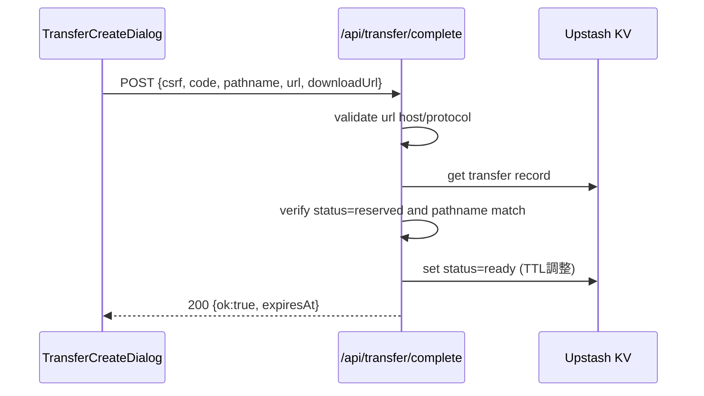
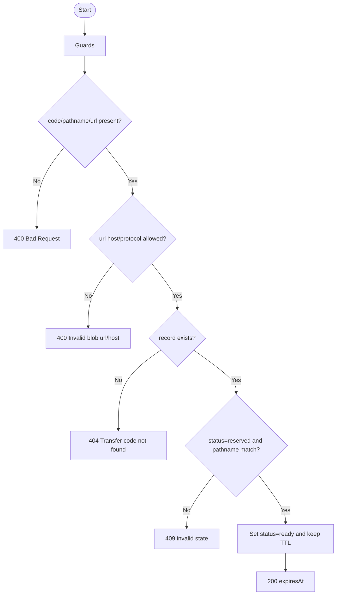

# API仕様書: `POST /api/transfer/complete`

## Endpoint Summary
- Route: `/api/transfer/complete`
- Method: `POST`
- Runtime: Node.js API Route
- 主な実装: `apps/web/api/transfer/complete.js`, `apps/web/api/transfer/_lib.js`
- 主な呼び出し元: `apps/web/src/features/transfer/useTransferApi.ts` (`completeTransfer()`), `apps/web/src/modals/dialogs/TransferCreateDialog.tsx`

## Non-IT向け説明
このAPIは、アップロード済み引継ぎデータを「利用可能状態（ready）」へ確定します。  
発行済みコードとアップロード結果（URL/パス）が一致することを確認します。  
不正なURLや状態不一致は拒否し、誤登録を防ぎます。  
業務上は、受け取り側がデータを見つけられるかを決める重要工程です。

## 利用フロー（Flow / 道筋）
| Item | 内容 |
| --- | --- |
| 起点機能/画面 | 引継ぎコード発行後のアップロード完了 |
| 呼び出しトリガー | クライアントがBlob `put` 成功後に実行 |
| 前段API/処理 | `/api/transfer/create` で `code/pathname` 取得済み |
| 当APIの役割 | レコード状態を `reserved -> ready` に遷移 |
| 後段API/処理 | 受け取り側が `/api/transfer/resolve` で解決可能になる |
| 失敗時経路 | `409` で状態不整合扱い、再発行を促す |
| 利用者への見え方 | 成功時のみ配布したコードで復元できる |

### フロー図（Mermaid: sequence）


### アルゴリズムフロー（Mermaid: flowchart）


## Request

### Query Parameters
| Name | Type | Required | Example | Purpose |
| --- | --- | --- | --- | --- |
| `health` | string | No | `1` | ヘルスチェック |

### Request Body
| Name | Type | Required | Example | Purpose |
| --- | --- | --- | --- | --- |
| `csrf` | string | Yes | `<csrf token>` | CSRF照合値 |
| `code` | string | Yes | `01234` | 引継ぎコード |
| `pathname` | string | Yes | `transfer/01234/transfer-...` | 期待アップロード先 |
| `url` | string | Yes | `https://public.blob.vercel-storage.com/...` | Blob URL |
| `downloadUrl` | string | No | `https://public.blob.vercel-storage.com/...` | ダウンロードURL（省略時は`url`） |

### Request Headers
| Header Name | Required | Example | Purpose | When |
| --- | --- | --- | --- | --- |
| `Origin` | Conditional | `https://shimmy3.com` | 許可オリジン検証 | 常時 |
| `Referer` | Conditional | `https://shimmy3.com/` | Origin補助判定 | 常時 |
| `Host` | Yes | `shimmy3.com` | 自サイト判定補助 | 常時 |
| `Cookie` | Yes | `csrf=...` | CSRF Cookie送信 | 常時 |
| `Content-Type` | Yes | `application/json` | JSON本文送信 | 常時 |
| `Accept` | No | `application/json` | JSON受信指定 | 常時 |
| `x-forwarded-for` | No | `203.0.113.10` | レート制限識別（インフラ由来） | 常時 |

### Request Cookies
| Cookie Name | Required | Example | Purpose |
| --- | --- | --- | --- |
| `csrf` | Yes | `csrf=...` | Body `csrf` との一致検証 |

## Response

### Status Codes
| Status | Body Example | Meaning |
| --- | --- | --- |
| `200` | `{ "ok": true, "expiresAt": "2026-02-17T...Z" }` | 完了登録成功 |
| `400` | `{ "ok": false, "error": "Bad Request" }` | 必須不足/URL不正 |
| `403` | `{ "ok": false, "error": "Forbidden: invalid CSRF token" }` | CSRF/Origin不正 |
| `404` | `{ "ok": false, "error": "Transfer code not found" }` | コード不在 |
| `405` | `{ "ok": false, "error": "Method Not Allowed" }` | POST以外 |
| `409` | `{ "ok": false, "error": "Transfer code is not in a valid state" }` | 状態不一致 |
| `429` | `{ "ok": false, "error": "Too Many Requests" }` | レート制限超過 |
| `500` | `{ "ok": false, "error": "..." }` | 予期しない内部エラー |

### Response Headers
| Header Name | Presence | Example | Purpose | When |
| --- | --- | --- | --- | --- |
| `Content-Type` | Usually | `application/json; charset=utf-8` | JSON本文通知 | 通常 |
| `Allow` | Conditional | `POST` | 許可メソッド通知 | `405` |
| `Retry-After` | Conditional | `60` | 再試行待機秒数 | `429` |

### Set-Cookie
なし

## 認証・認可
- Session: 不要
- CSRF: 必須（`csrf` Cookie + Body `csrf`）
- Origin check: 有効
- Rate limit: `transfer:complete`, `30 requests / 60 sec`

## エラーと利用者影響
| Error Case | User Impact | Operation Response |
| --- | --- | --- |
| `404` | 発行コードが使えない | 再発行を案内 |
| `409` | アップロード済みでも確定不可 | `create -> upload -> complete` の順序確認 |
| `400` | URL不正で確定不可 | 許可ホスト設定とURLを確認 |

## 業務影響
完了登録が失敗すると、利用者へ配布したコードが復元不能となり、移行手順が再作業になります。

## OpenAPI snippet
```yaml
paths:
  /api/transfer/complete:
    post:
      summary: Finalize uploaded transfer payload
      requestBody:
        required: true
        content:
          application/json:
            schema:
              type: object
              required: [csrf, code, pathname, url]
              properties:
                csrf:
                  type: string
                code:
                  type: string
                  pattern: '^[0-9]{5}$'
                pathname:
                  type: string
                url:
                  type: string
                downloadUrl:
                  type: string
      responses:
        "200":
          description: Transfer marked as ready
        "400":
          description: Invalid request/url
        "403":
          description: Forbidden (origin/csrf)
        "404":
          description: Transfer code not found
        "405":
          description: Method Not Allowed
        "409":
          description: Invalid transfer state
        "429":
          description: Too Many Requests
        "500":
          description: Internal Server Error
      security:
        - cookieCsrf: []
```

## 未確認項目
1. `downloadUrl` 省略時（`url` フォールバック）の利用率。

## Glossary
- Ready状態: 受け取り側が解決可能になった状態。
- Host allowlist: 許可された保存先ドメインだけを受け付ける制御。
