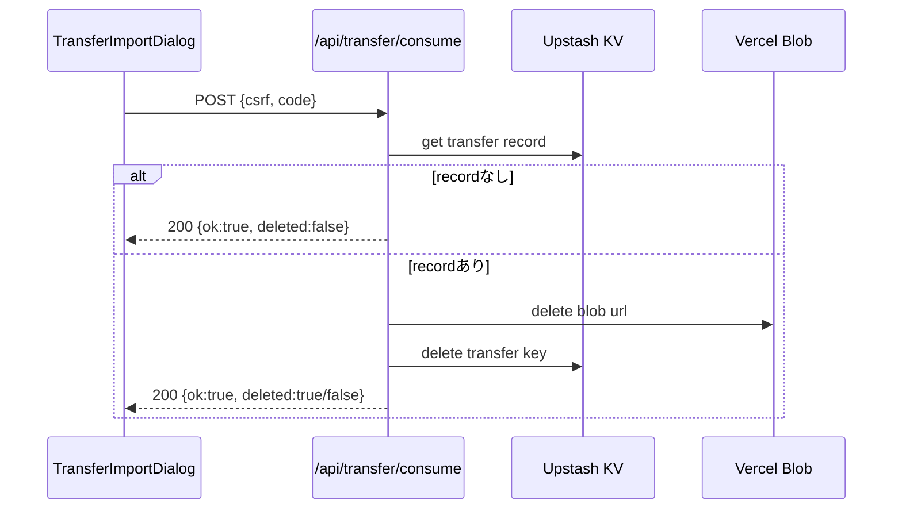

# API仕様書: `POST /api/transfer/consume`

## Endpoint Summary
- Route: `/api/transfer/consume`
- Method: `POST`
- Runtime: Node.js API Route
- 主な実装: `apps/web/api/transfer/consume.js`, `apps/web/api/transfer/_lib.js`
- 主な呼び出し元: `apps/web/src/features/transfer/useTransferApi.ts` (`consumeTransfer()`), `apps/web/src/modals/dialogs/TransferImportDialog.tsx`

## Non-IT向け説明
このAPIは、復元後に引継ぎデータを削除して再利用を防ぎます。  
Blob本体とコード管理レコードを順に消し、使い捨て運用を実現します。  
対象が既に存在しない場合は成功扱いで終了します。  
業務上は、機密データの残留を減らすセキュリティ上の重要APIです。

## 利用フロー（Flow / 道筋）
| Item | 内容 |
| --- | --- |
| 起点機能/画面 | 引継ぎ復元ダイアログ |
| 呼び出しトリガー | 復元成功後に後始末として実行 |
| 前段API/処理 | `/api/transfer/resolve` 成功、データ復元完了 |
| 当APIの役割 | Blob削除とKVコード削除 |
| 後段API/処理 | 画面に復元完了表示 |
| 失敗時経路 | 本API失敗でも復元自体は完了として扱う（警告ログ） |
| 利用者への見え方 | 通常は意識しない内部クリーンアップ |

### フロー図（Mermaid: sequence）


### アルゴリズムフロー（Mermaid: flowchart）
```mermaid
flowchart TD
  S([Start]) --> G[Guards]
  G --> CODE{code valid?}
  CODE -- No --> E400[400 Bad Request]
  CODE -- Yes --> REC{record exists?}
  REC -- No --> R200A[200 deleted:false]
  REC -- Yes --> CFG{BLOB_READ_WRITE_TOKEN exists?}
  CFG -- No --> E500[500 Server configuration error]
  CFG -- Yes --> URL{record.url exists?}
  URL -- No --> DELKV[Delete KV key]
  URL -- Yes --> DELBLOB[Validate host and delete blob]
  DELBLOB --> ERR404{blob already missing(404)?}
  ERR404 -- Yes --> DELKV
  ERR404 -- No and error --> E500B[500 or upstream status]
  DELKV --> R200B[200 deleted based on url presence]
```

## Request

### Query Parameters
| Name | Type | Required | Example | Purpose |
| --- | --- | --- | --- | --- |
| `health` | string | No | `1` | ヘルスチェック |

### Request Body
| Name | Type | Required | Example | Purpose |
| --- | --- | --- | --- | --- |
| `csrf` | string | Yes | `<csrf token>` | CSRF照合値 |
| `code` | string | Yes | `01234` | 削除対象引継ぎコード |

### Request Headers
| Header Name | Required | Example | Purpose | When |
| --- | --- | --- | --- | --- |
| `Origin` | Conditional | `https://shimmy3.com` | 許可オリジン検証 | 常時 |
| `Referer` | Conditional | `https://shimmy3.com/` | Origin補助判定 | 常時 |
| `Host` | Yes | `shimmy3.com` | 自サイト判定補助 | 常時 |
| `Cookie` | Yes | `csrf=...` | CSRF Cookie送信 | 常時 |
| `Content-Type` | Yes | `application/json` | JSON本文送信 | 常時 |
| `Accept` | No | `application/json` | JSON受信指定 | 常時 |
| `x-forwarded-for` | No | `203.0.113.10` | レート制限識別（インフラ由来） | 常時 |

### Request Cookies
| Cookie Name | Required | Example | Purpose |
| --- | --- | --- | --- |
| `csrf` | Yes | `csrf=...` | Body `csrf` との一致検証 |

## Response

### Status Codes
| Status | Body Example | Meaning |
| --- | --- | --- |
| `200` | `{ "ok": true, "deleted": true }` | 削除成功 |
| `200` | `{ "ok": true, "deleted": false }` | 対象なし（冪等扱い） |
| `400` | `{ "ok": false, "error": "Bad Request" }` | コード形式不正/URL検証失敗 |
| `403` | `{ "ok": false, "error": "Forbidden: invalid CSRF token" }` | CSRF/Origin不正 |
| `405` | `{ "ok": false, "error": "Method Not Allowed" }` | POST以外 |
| `429` | `{ "ok": false, "error": "Too Many Requests" }` | レート制限超過 |
| `500` | `{ "ok": false, "error": "Server configuration error" }` | サーバー設定不足または削除失敗 |

### Response Headers
| Header Name | Presence | Example | Purpose | When |
| --- | --- | --- | --- | --- |
| `Content-Type` | Usually | `application/json; charset=utf-8` | JSON本文通知 | 通常 |
| `Allow` | Conditional | `POST` | 許可メソッド通知 | `405` |
| `Retry-After` | Conditional | `60` | 再試行待機秒数 | `429` |

### Set-Cookie
なし

## 認証・認可
- Session: 不要
- CSRF: 必須（`csrf` Cookie + Body `csrf`）
- Origin check: 有効
- Rate limit: `transfer:consume`, `30 requests / 60 sec`

## エラーと利用者影響
| Error Case | User Impact | Operation Response |
| --- | --- | --- |
| `500` | 復元後の後始末だけ失敗する可能性 | 運用監視で残留データ確認 |
| `429` | 削除要求が遅延 | 時間を空けて再試行 |

## 業務影響
削除工程が機能しないと、期限内データが残留し、情報管理リスクが高まります。

## OpenAPI snippet
```yaml
paths:
  /api/transfer/consume:
    post:
      summary: Consume transfer code and delete payload
      requestBody:
        required: true
        content:
          application/json:
            schema:
              type: object
              required: [csrf, code]
              properties:
                csrf:
                  type: string
                code:
                  type: string
                  pattern: '^[0-9]{5}$'
      responses:
        "200":
          description: Consume processed
        "400":
          description: Invalid request/blob url
        "403":
          description: Forbidden (origin/csrf)
        "405":
          description: Method Not Allowed
        "429":
          description: Too Many Requests
        "500":
          description: Server configuration or delete failure
      security:
        - cookieCsrf: []
```

## 未確認項目
1. 復元成功後に `consume` が失敗したケースの自動再試行方針。

## Glossary
- Consume: 一度使ったコードを無効化し、関連データを削除する処理。
- Idempotent: 同じ操作を繰り返しても結果が破綻しない性質。
