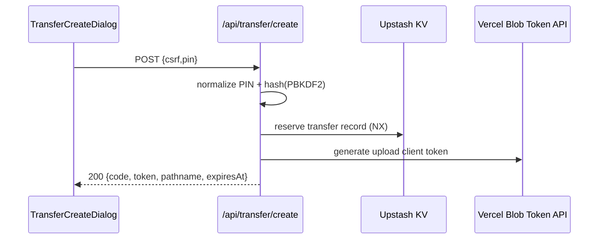
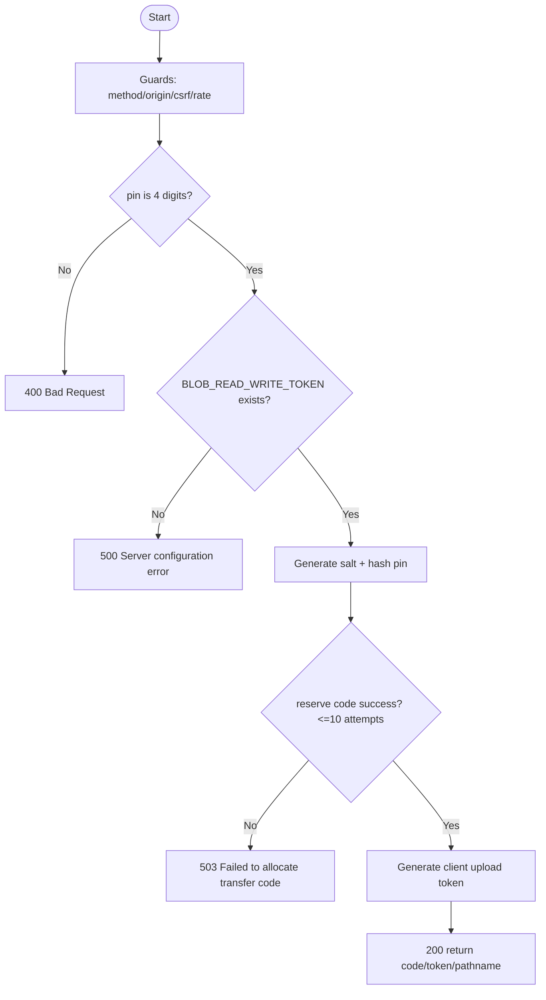

# API仕様書: `POST /api/transfer/create`

## Endpoint Summary
- Route: `/api/transfer/create`
- Method: `POST`
- Runtime: Node.js API Route
- 主な実装: `apps/web/api/transfer/create.js`, `apps/web/api/transfer/_lib.js`
- 主な呼び出し元: `apps/web/src/features/transfer/useTransferApi.ts` (`createTransfer()`), `apps/web/src/modals/dialogs/TransferCreateDialog.tsx`

## Non-IT向け説明
このAPIは、引継ぎコード（5桁）を発行し、アップロード用の一時トークンを返します。  
暗証番号（PIN）は平文保存せず、ハッシュ化して記録します。  
このAPIの成功後に実データのアップロードと確定処理へ進みます。  
業務上は、端末移行フローの開始地点として重要です。

## 利用フロー（Flow / 道筋）
| Item | 内容 |
| --- | --- |
| 起点機能/画面 | 引継ぎコード発行ダイアログ |
| 呼び出しトリガー | 利用者が4桁PINを入力して発行ボタンを押下 |
| 前段API/処理 | `/api/blob/csrf` でCSRFトークン取得 |
| 当APIの役割 | コード予約、PINハッシュ保存、Blobアップロードトークン発行 |
| 後段API/処理 | クライアントがBlobアップロードし `/api/transfer/complete` 実行 |
| 失敗時経路 | `400/500/503` で発行失敗をUI表示 |
| 利用者への見え方 | 成功時に5桁コードと有効期限が表示される |

### フロー図（Mermaid: sequence）


### アルゴリズムフロー（Mermaid: flowchart）


## Request

### Query Parameters
| Name | Type | Required | Example | Purpose |
| --- | --- | --- | --- | --- |
| `health` | string | No | `1` | ヘルスチェック |

### Request Body
| Name | Type | Required | Example | Purpose |
| --- | --- | --- | --- | --- |
| `csrf` | string | Yes | `<csrf token>` | CSRF照合値（Body） |
| `pin` | string | Yes | `1234` | 4桁暗証番号 |

### Request Headers
| Header Name | Required | Example | Purpose | When |
| --- | --- | --- | --- | --- |
| `Origin` | Conditional | `https://shimmy3.com` | 許可オリジン検証 | 常時 |
| `Referer` | Conditional | `https://shimmy3.com/` | Origin補助判定 | 常時 |
| `Host` | Yes | `shimmy3.com` | 自サイト判定補助 | 常時 |
| `Cookie` | Yes | `csrf=...` | CSRF Cookie送信 | 常時 |
| `Content-Type` | Yes | `application/json` | JSON本文送信 | 常時 |
| `Accept` | No | `application/json` | JSON受信指定 | 常時 |
| `x-forwarded-for` | No | `203.0.113.10` | レート制限識別（インフラ由来） | 常時 |

### Request Cookies
| Cookie Name | Required | Example | Purpose |
| --- | --- | --- | --- |
| `csrf` | Yes | `csrf=...` | Body `csrf` との一致検証 |

## Response

### Status Codes
| Status | Body Example | Meaning |
| --- | --- | --- |
| `200` | `{ "ok": true, "code":"01234", "token":"...", "pathname":"...", "expiresAt":"..." }` | 発行成功 |
| `400` | `{ "ok": false, "error": "Bad Request" }` | PIN不正など入力不備 |
| `403` | `{ "ok": false, "error": "Forbidden: invalid CSRF token" }` | CSRF/Origin不正 |
| `405` | `{ "ok": false, "error": "Method Not Allowed" }` | POST以外 |
| `429` | `{ "ok": false, "error": "Too Many Requests" }` | レート制限超過 |
| `500` | `{ "ok": false, "error": "Server configuration error" }` | サーバー設定不足 |
| `503` | `{ "ok": false, "error": "Failed to allocate transfer code" }` | コード割当不能 |

### Response Headers
| Header Name | Presence | Example | Purpose | When |
| --- | --- | --- | --- | --- |
| `Content-Type` | Usually | `application/json; charset=utf-8` | JSON本文通知 | 通常 |
| `Allow` | Conditional | `POST` | 許可メソッド通知 | `405` |
| `Retry-After` | Conditional | `60` | 再試行待機秒数 | `429` |

### Set-Cookie
なし

## 認証・認可
- Session: 不要
- CSRF: 必須（`csrf` Cookie + Body `csrf`）
- Origin check: 有効
- Rate limit: `transfer:create`, `10 requests / 60 sec`

## エラーと利用者影響
| Error Case | User Impact | Operation Response |
| --- | --- | --- |
| `400` | コード発行できない | PIN再入力を案内 |
| `500` | 常時発行不可 | サーバー設定確認 |
| `503` | 一時的に発行不可 | 時間を空け再試行 |

## 業務影響
コード発行が止まると端末移行導線が開始できず、データ引継ぎ自体が停止します。

## OpenAPI snippet
```yaml
paths:
  /api/transfer/create:
    post:
      summary: Reserve transfer code and issue upload token
      requestBody:
        required: true
        content:
          application/json:
            schema:
              type: object
              required: [csrf, pin]
              properties:
                csrf:
                  type: string
                pin:
                  type: string
                  pattern: '^[0-9]{4}$'
      responses:
        "200":
          description: Transfer slot reserved
        "400":
          description: Invalid request
        "403":
          description: Forbidden (origin/csrf)
        "405":
          description: Method Not Allowed
        "429":
          description: Too Many Requests
        "500":
          description: Server configuration error
        "503":
          description: Failed to allocate transfer code
      security:
        - cookieCsrf: []
```

## 未確認項目
1. 10回リトライで `503` になる確率の運用実測値。

## Glossary
- PBKDF2: 暗証番号を強化して保存するためのハッシュ方式。
- NX: KV保存時に「未存在なら保存する」条件。
