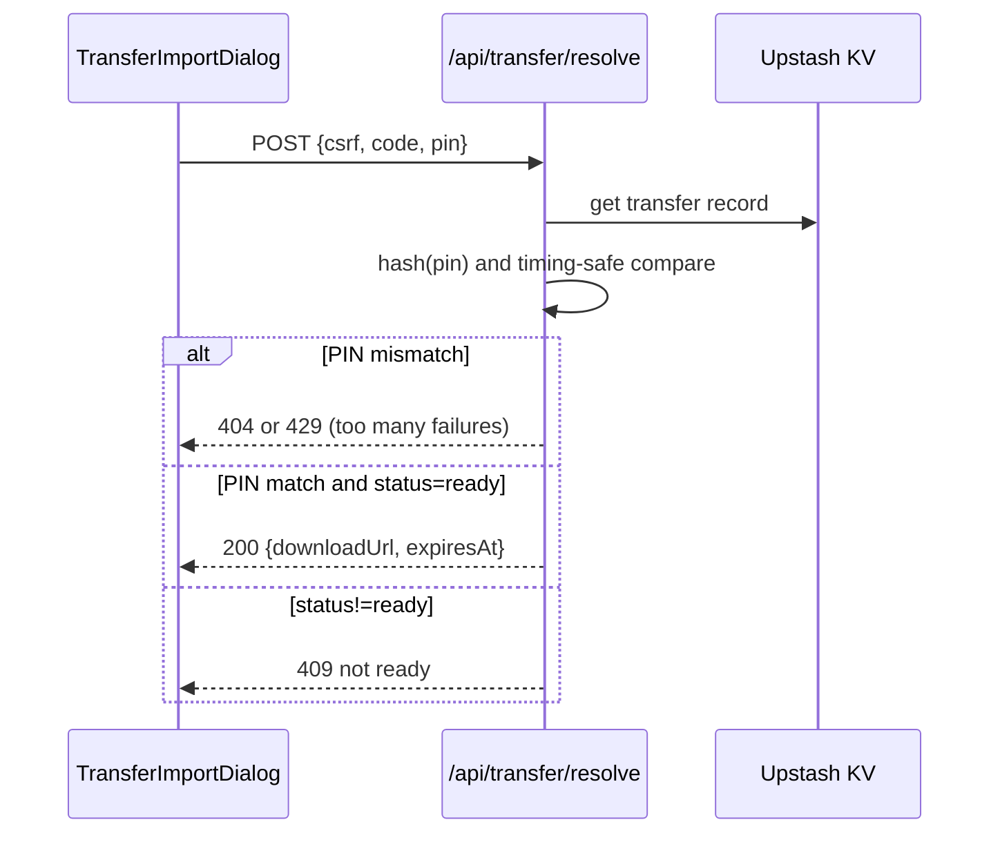
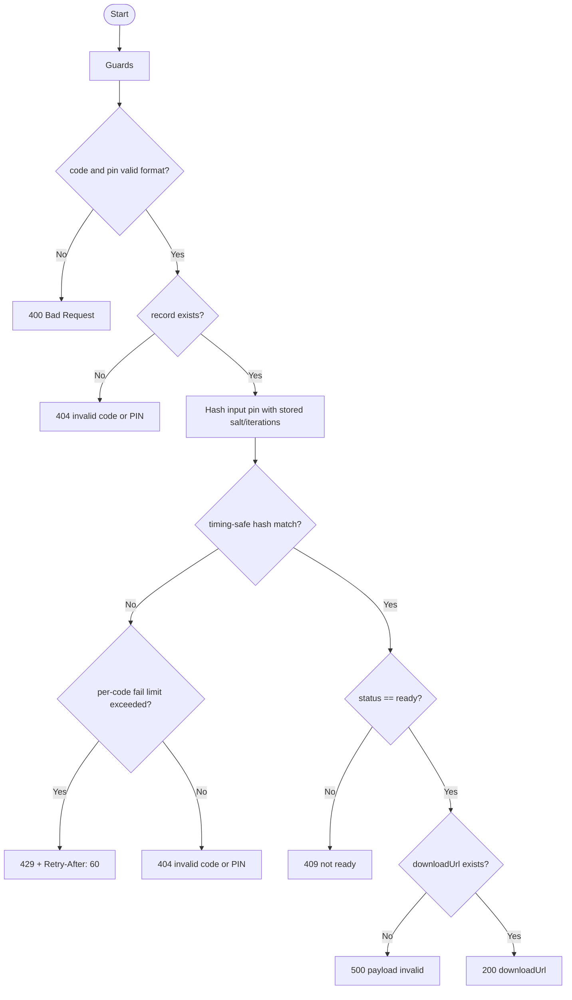

# API仕様書: `POST /api/transfer/resolve`

## Endpoint Summary
- Route: `/api/transfer/resolve`
- Method: `POST`
- Runtime: Node.js API Route
- 主な実装: `apps/web/api/transfer/resolve.js`, `apps/web/api/transfer/_lib.js`
- 主な呼び出し元: `apps/web/src/features/transfer/useTransferApi.ts` (`resolveTransfer()`), `apps/web/src/modals/dialogs/TransferImportDialog.tsx`

## Non-IT向け説明
このAPIは、引継ぎコードと暗証番号を照合してダウンロード先URLを返します。  
暗証番号はタイミング攻撃対策付きで比較され、誤入力が続く場合は制限されます。  
コードが未確定（readyでない）なら利用できません。  
業務上は、復元可否を決定する最重要APIです。

## 利用フロー（Flow / 道筋）
| Item | 内容 |
| --- | --- |
| 起点機能/画面 | 引継ぎコード入力ダイアログ（復元側） |
| 呼び出しトリガー | 利用者が `code + pin` を入力して復元開始 |
| 前段API/処理 | 発行側で `create -> complete` 済み |
| 当APIの役割 | コード/PIN照合、状態確認、`downloadUrl` 返却 |
| 後段API/処理 | クライアントがBlobをダウンロードし復元実行 |
| 失敗時経路 | `404/409/429` を利用者へ明示 |
| 利用者への見え方 | 正常時のみ復元へ進める |

### フロー図（Mermaid: sequence）


### アルゴリズムフロー（Mermaid: flowchart）


## Request

### Query Parameters
| Name | Type | Required | Example | Purpose |
| --- | --- | --- | --- | --- |
| `health` | string | No | `1` | ヘルスチェック |

### Request Body
| Name | Type | Required | Example | Purpose |
| --- | --- | --- | --- | --- |
| `csrf` | string | Yes | `<csrf token>` | CSRF照合値 |
| `code` | string | Yes | `01234` | 5桁引継ぎコード |
| `pin` | string | Yes | `1234` | 4桁暗証番号 |

### Request Headers
| Header Name | Required | Example | Purpose | When |
| --- | --- | --- | --- | --- |
| `Origin` | Conditional | `https://shimmy3.com` | 許可オリジン検証 | 常時 |
| `Referer` | Conditional | `https://shimmy3.com/` | Origin補助判定 | 常時 |
| `Host` | Yes | `shimmy3.com` | 自サイト判定補助 | 常時 |
| `Cookie` | Yes | `csrf=...` | CSRF Cookie送信 | 常時 |
| `Content-Type` | Yes | `application/json` | JSON本文送信 | 常時 |
| `Accept` | No | `application/json` | JSON受信指定 | 常時 |
| `x-forwarded-for` | No | `203.0.113.10` | レート制限識別（インフラ由来） | 常時 |

### Request Cookies
| Cookie Name | Required | Example | Purpose |
| --- | --- | --- | --- |
| `csrf` | Yes | `csrf=...` | Body `csrf` との一致検証 |

## Response

### Status Codes
| Status | Body Example | Meaning |
| --- | --- | --- |
| `200` | `{ "ok": true, "downloadUrl": "https://...", "createdAt":"...", "expiresAt":"..." }` | 照合成功 |
| `400` | `{ "ok": false, "error": "Bad Request" }` | 入力形式不正 |
| `403` | `{ "ok": false, "error": "Forbidden: invalid CSRF token" }` | CSRF/Origin不正 |
| `404` | `{ "ok": false, "error": "Transfer code or PIN is invalid" }` | コードまたはPIN不正 |
| `405` | `{ "ok": false, "error": "Method Not Allowed" }` | POST以外 |
| `409` | `{ "ok": false, "error": "Transfer code is not ready" }` | 未確定状態 |
| `429` | `{ "ok": false, "error": "Too Many Requests" }` | 試行過多（全体またはPIN誤り連続） |
| `500` | `{ "ok": false, "error": "Transfer payload is invalid" }` | レコード不正 |

### Response Headers
| Header Name | Presence | Example | Purpose | When |
| --- | --- | --- | --- | --- |
| `Content-Type` | Usually | `application/json; charset=utf-8` | JSON本文通知 | 通常 |
| `Allow` | Conditional | `POST` | 許可メソッド通知 | `405` |
| `Retry-After` | Conditional | `60` | 再試行待機秒数 | `429` |

### Set-Cookie
なし

## 認証・認可
- Session: 不要
- CSRF: 必須（`csrf` Cookie + Body `csrf`）
- Origin check: 有効
- Rate limit:
  - グローバル: `transfer:resolve`, 既定 `30 requests / 60 sec`（環境変数で変更可）
  - 追加: コード単位PIN失敗制限（既定 `20 / 60 sec`、超過で `429`）

## エラーと利用者影響
| Error Case | User Impact | Operation Response |
| --- | --- | --- |
| `404` | コード/暗証番号が通らない | 再入力、発行者確認 |
| `409` | 発行済みでも復元できない | 発行側の `complete` 実行確認 |
| `429` | 連続試行が一時停止 | 待機後に再試行 |

## 業務影響
復元APIの判定品質が低いと、正当ユーザーの復元失敗と不正試行耐性低下の両方を招きます。

## OpenAPI snippet
```yaml
paths:
  /api/transfer/resolve:
    post:
      summary: Resolve transfer code and PIN to download URL
      requestBody:
        required: true
        content:
          application/json:
            schema:
              type: object
              required: [csrf, code, pin]
              properties:
                csrf:
                  type: string
                code:
                  type: string
                  pattern: '^[0-9]{5}$'
                pin:
                  type: string
                  pattern: '^[0-9]{4}$'
      responses:
        "200":
          description: Transfer resolved
        "400":
          description: Invalid request
        "403":
          description: Forbidden (origin/csrf)
        "404":
          description: Invalid code or PIN
        "405":
          description: Method Not Allowed
        "409":
          description: Transfer not ready
        "429":
          description: Too Many Requests
          headers:
            Retry-After:
              schema:
                type: string
        "500":
          description: Transfer payload invalid
      security:
        - cookieCsrf: []
```

## 未確認項目
1. PIN誤入力制限値（既定20/分）の運用チューニング方針。

## Glossary
- Timing-safe compare: 比較時間差から情報漏えいしないようにする比較方式。
- Ready: 復元可能な状態に確定済みであること。
