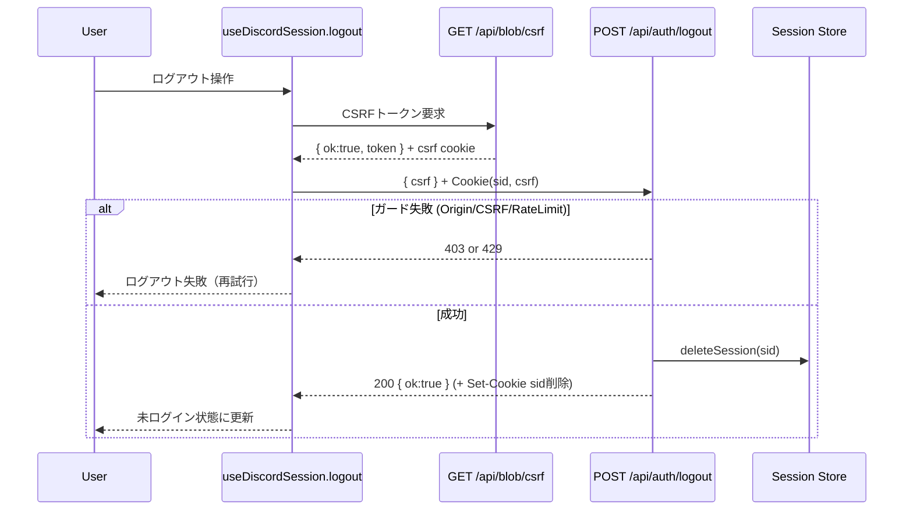

# API仕様書: `POST /api/auth/logout`

## Endpoint Summary
- Route: `/api/auth/logout`
- Method: `POST`
- Runtime: Node.js API Route
- 主な実装:
  - `apps/web/api/auth/logout.js`
  - `apps/web/api/_lib/apiGuards.js`
  - `apps/web/api/_lib/origin.js`
  - `apps/web/api/_lib/cookies.js`
- 主な呼び出し元:
  - `apps/web/src/features/discord/useDiscordSession.ts` (`logout()` 内)

## Non-IT向け説明
このAPIは「現在使っている端末のログイン状態を終了する」ためのAPIです。  
利用者がログアウトボタンを押した後、このAPIがセッションを無効化します。  
不正なサイトから勝手にログアウトさせられないように、送信元チェックとCSRFチェックを行います。  
業務上は、共用端末での情報残存リスクを下げるために重要です。

## 利用フロー（Flow / 道筋）
| Item | 内容 |
| --- | --- |
| 起点機能/画面 | ガチャ画面のDiscordログインUI (`DiscordLoginButton`) |
| 呼び出しトリガー | 利用者がログアウト操作を実行 |
| 前段API/処理 | フロントが `GET /api/blob/csrf` でCSRFトークンを取得 |
| 当APIの役割 | `sid` セッションを削除し、必要に応じて `sid` クッキー削除を返す |
| 後段API/処理 | フロントが `['discord','session']` クエリを無効化しログイン状態再取得 |
| 失敗時経路 | 403/429等のときログアウト未完了のため、再試行または再読み込み案内 |
| 利用者への見え方 | ログアウト成功なら未ログイン表示へ切替。失敗時はログイン状態が残る |

### フロー図（Mermaid）


## Request

### Query Parameters
通常の `POST` ログアウト処理では使用しません。

| Name | Type | Required | Example | Purpose |
| --- | --- | --- | --- | --- |
| `health` | string | No | `1` | 監視用途。`GET /api/auth/logout?health=1` のみヘルス応答 |

### Request Body
| Name | Type | Required | Example | Purpose |
| --- | --- | --- | --- | --- |
| `csrf` | string | Yes | `"vQx...abc"` | `csrf` クッキー値との一致検証（Double Submit Cookie） |

### Request Headers
| Header Name | Required | Example | Purpose | When |
| --- | --- | --- | --- | --- |
| `Origin` | Conditional | `https://shimmy3.com` | 同一オリジン検証 | ブラウザ送信時 |
| `Referer` | Conditional | `https://shimmy3.com/gacha` | `Origin` 不在時の補助判定 | `Origin` 欠落時 |
| `Host` | Yes | `shimmy3.com` | 自ホスト判定補助 | 常時 |
| `Cookie` | Yes | `sid=...; csrf=...` | セッション識別とCSRF照合元 | 常時 |
| `Content-Type` | Yes | `application/json` | ボディ形式識別 | `POST` |
| `Accept` | No | `application/json` | クライアント期待形式の明示 | 任意 |
| `x-forwarded-for` | No | `203.0.113.10` | レート制限識別（IPハッシュ計算） | インフラ付与時 |

### Request Cookies
| Cookie Name | Required | Example | Purpose | Attributes (known) |
| --- | --- | --- | --- | --- |
| `sid` | No | `sid=abc...` | 削除対象セッション識別子（無くても200応答） | `HttpOnly`, `Secure`, `SameSite=Lax`, `Path=/` |
| `csrf` | Yes | `csrf=xyz...` | リクエスト本文 `csrf` との一致検証 | `HttpOnly`, `Secure`, `SameSite=Lax`, `Path=/`, `Domain=.shimmy3.com` |

## Response

### Status Codes
| Status | Body Example | Meaning |
| --- | --- | --- |
| `200` | `{ "ok": true }` | ログアウト処理完了（`sid` 無しでも成功扱い） |
| `403` | `{ "ok": false, "error": "Forbidden: origin not allowed" }` | Origin検証失敗 |
| `403` | `{ "ok": false, "error": "Forbidden: invalid CSRF token", "errorCode":"csrf_token_mismatch" }` | CSRF照合失敗 |
| `405` | `{ "ok": false, "error": "Method Not Allowed" }` | `POST` 以外のメソッド（ヘルスチェック除く） |
| `429` | `{ "ok": false, "error": "Too Many Requests" }` | レート制限超過 |
| `500` | (実装依存) | セッション削除処理などの予期しない内部エラー |

### ヘルスチェック例外
`GET /api/auth/logout?health=1` の場合はガードで早期に以下を返します。

```json
{ "ok": true, "route": "/api/auth/logout" }
```

### Response Headers
| Header Name | Presence | Example | Purpose | When |
| --- | --- | --- | --- | --- |
| `Content-Type` | Usually | `application/json; charset=utf-8` | JSONレスポンスの形式通知 | `res.json` 応答時 |
| `Allow` | Conditional | `POST` | 許可メソッド通知 | `405` |
| `Retry-After` | Conditional | `60` | 再試行待機秒数 | `429` |
| `Set-Cookie` | Conditional | `sid=; Max-Age=0; Path=/; HttpOnly; Secure; SameSite=Lax` | セッションCookie削除 | `sid` が存在した成功時 |

### Set-Cookie
| Cookie Name | Trigger | Example | Attributes | Purpose |
| --- | --- | --- | --- | --- |
| `sid` | `sid` が存在する成功時 | `sid=; Max-Age=0` | `HttpOnly`, `Secure`, `SameSite=Lax`, `Path=/` | 端末セッションCookie削除 |

## 認証・認可
- Session: 必須ではない（`sid` が無い場合も `200 {ok:true}`）。
- CSRF: 必須（`csrf` クッキーと本文 `csrf` の一致）。
- Origin check: 有効（許可オリジンのみ）。
- Rate limit: `auth:logout`, `30 requests / 60 sec`。

## エラーと利用者影響
| Error Case | User Impact | Operation Response |
| --- | --- | --- |
| `403` (Origin) | ログアウトできない | 正しいドメインから再実行。組込WebView設定確認 |
| `403` (CSRF) | ログアウトできない | `GET /api/blob/csrf` でトークン再取得後に再試行 |
| `405` | 操作失敗 | クライアント実装が `POST` で送っているか確認 |
| `429` | 一時的にログアウトできない | `Retry-After` 秒待って再試行 |
| `500` | ログアウト状態が不明 | 再読み込みして状態再確認。サーバーログ調査 |

## 業務影響
ログアウトが失敗すると共用端末でセッションが残る可能性があり、情報管理上のリスクが上がるため、失敗時の再試行導線は必須です。

## OpenAPI snippet
```yaml
paths:
  /api/auth/logout:
    post:
      summary: Logout current device session
      description: >
        Invalidates current session cookie when present.
        Requires same-origin and CSRF validation.
      parameters:
        - in: header
          name: Origin
          required: false
          schema:
            type: string
        - in: header
          name: Referer
          required: false
          schema:
            type: string
        - in: header
          name: Cookie
          required: true
          schema:
            type: string
        - in: header
          name: Content-Type
          required: true
          schema:
            type: string
            enum: [application/json]
      requestBody:
        required: true
        content:
          application/json:
            schema:
              type: object
              required: [csrf]
              properties:
                csrf:
                  type: string
      responses:
        "200":
          description: Logout completed
          content:
            application/json:
              schema:
                type: object
                properties:
                  ok:
                    type: boolean
          headers:
            Set-Cookie:
              description: Returned when sid cookie is cleared
              schema:
                type: string
        "403":
          description: Forbidden (origin or csrf validation failed)
        "405":
          description: Method Not Allowed
          headers:
            Allow:
              schema:
                type: string
        "429":
          description: Too Many Requests
          headers:
            Retry-After:
              schema:
                type: string
        "500":
          description: Internal Server Error
      security: []
```

## 未確認項目
1. `deleteSession` 失敗時の `500` ボディ形式はハンドラで明示固定されていないため、実行環境のデフォルト応答に依存する可能性があります。
2. `Set-Cookie` の属性出力順序は実装上の意味を持たないため、プロキシや実行環境で順序が変わる可能性があります。

## Glossary
- Session: ログイン中であることを識別するサーバー側状態。
- Cookie: ブラウザに保存される小さな状態情報。
- CSRF: 第三者サイト経由の不正操作を防ぐための検証。
- Origin: リクエストの送信元サイト情報（スキーム+ホスト+ポート）。
- Rate Limit: 一定時間に許可するリクエスト回数の制限。
