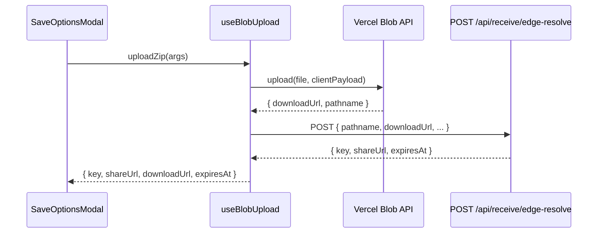

# blob-upload (React 移行版) 仕様

本ドキュメントは旧 `blob-upload.js` を React 化するための要件定義であり、ZIP 生成までの手順を最新のデータモデルに合わせて再設計する。アップロード API まわりの挙動は従来どおり維持する。

## 1. スコープとゴール
- `SaveOptionsModal` から利用される ZIP 作成・アップロードユーティリティを React/TypeScript で実装する。
- React 側で導入した **正規化済みエンティティストア** に対応し、ユーザー単位での ZIP 出力が破綻しないことを保証する。
- Vercel Blob へのアップロード、共有 URL 発行、localStorage への記録仕様は旧実装を踏襲する。

## 2. モジュール構成
```
app/
  hooks/
    useZipBuilder.ts        // ZIP 構築ロジックをカプセル化
    useBlobUpload.ts        // CSRF・@vercel/blob 呼び出し
  stores/
    archiveStore.ts         // React 移行後のデータ正規化ストア
  features/saveOptions/
    SaveOptionsModal.tsx    // UI (仕様は doc/modals/save_options_modal_spec.md )
    SaveOptionsController.tsx // ボタン → フック呼び出しを仲介
```

### エクスポート
- `useZipBuilder()` … `buildUserZip(userId, options)` を返す。Promise で `{ blob, fileName, fileCount, totalBytes }` を解決。
  - `archiveStore` から `users`, `UserBundle`, `gachaById`, `pullsById`, `assetsById` を読み込み、レア度や演出（`effects`）の定義は `gachaById[gachaId].effects` と `UserBundle.itemSummary` を組み合わせて決定する。
- `useBlobUpload()` … `uploadZip({ file, fileName, userId })` を返す。内部で CSRF 取得と `/api/blob/upload` 呼び出しを隠蔽。
- `useSaveOptionsActions()` … モーダル内のボタンが呼び出すハンドラを提供。`doc/modals/save_options_modal_spec.md` に準拠。

## 3. データモデル前提
React 化後のストアは以下の正規化テーブルを持つ。

```ts
// stores/archiveStore.ts
interface ArchiveStoreState {
  users: Record<UserId, UserEntity>;
  gachaById: Record<GachaId, GachaEntity>;
  pullsById: Record<PullId, PullEntity>;          // 単発ガチャ結果
  bundlesByUser: Record<UserId, UserBundle>;      // ユーザー単位の集計済みビュー
  assetsById: Record<AssetId, AssetEntity>;       // IndexedDB / Remote の実データ参照
  skipSet: Set<AssetId>;                          // リアグ対象
}

interface UserEntity {
  id: UserId;
  displayName: string;
  memo?: string;
  discordUserId: string;         // 共有URL用のディレクトリを決めるために必須
}

interface UserBundle {
  userId: UserId;
  pulls: PullId[];            // ユーザーが保持する Pull の ID 一覧
  gachaIds: GachaId[];        // 利用されたガチャ ID
  itemSummary: Record<Rarity, string[]>; // rarity → アイテムコード配列（UI 表示用）
}

interface AssetEntity {
  id: AssetId;                // `${gachaId}:${rarity}:${code}` を base64url 化
  mimeType: string;
  size: number;               // IndexedDB 保存サイズ
  blobRef: AssetBlobRef;      // { kind: 'idb', key } | { kind: 'remote', url }
  fileNameHint?: string;      // 元ファイル名
  createdAt: string;
}
```

> `skipSet` と `AssetEntity.id` は 1:1 対応。React 側では `skipSet.has(assetId)` で除外対象を判定する。

## 4. ZIP 生成仕様
`buildUserZip(userId, { includeMeta = true })`

1. **入力検証**
   - `users[userId]` が存在しなければ `UserNotFoundError`。
   - `UserBundle` が存在しない、もしくは `pulls.length === 0` の場合は `NoExportableAssetsError`。
   - `assetsById` から `skipSet` を除いた `targetAssets` を生成し、0 件なら `NoExportableAssetsError`。

2. **ファイル名決定**
   - ベースファイル名: `sanitize(user.displayName || 'user') + '_' + now(YYYYMMDD_HHmm)`。
   - ZIP 自体のファイル名: `${baseName}.zip`（React 側で `fileName` として返却）。
   - ZIP 内の個別ファイル名: `${sanitize(gacha.name)}/${rarity}_${sanitize(item.code)}${extension}`。
   - 拡張子は `mimeType` → `extensionMap` で推定。未定義の場合は `.bin`。
   - 同名衝突時は `(1)`, `(2)` と連番付与。

3. **Blob 取得**
   - `AssetEntity.blobRef.kind === 'idb'` → `IndexedDB.get(blobRef.key)` を `idbWorker` 経由で取得。
   - `kind === 'remote'` → `fetch` で取得。CORS 失敗時はスキップし、警告を収集。
   - 取得失敗の資産は `skippedAssets` に集計し ZIP には含めない。

4. **ZIP への書き込み**
   - `JSZip` を使用。バイナリ資産は `compression: 'STORE'`。
   - 付随メタデータ: `meta/app_state_v2.json` に以下を保存。
     ```jsonc
     {
       "version": 2,
       "generatedAt": "ISO-8601",
       "user": { "id": "...", "displayName": "...", "memo": "..." },
       "gacha": [ { "id": "gachaId", "name": "…", "rarityOrder": ["SSR", "SR", ...] } ],
       "pulls": [
         {
           "id": "pullId",
           "gachaId": "...",
           "rolledAt": "ISO-8601",
           "items": [ { "assetId": "...", "rarity": "SSR", "code": "No.15" } ]
         }
       ],
       "assets": [
         {
           "id": "assetId",
           "file": "gacha/SSR_code.png",
           "mimeType": "image/png",
           "size": 12345,
           "source": AssetEntity.blobRef
         }
       ],
       "skip": ["assetId", ...],
       "warnings": ["remote fetch failed: assetId", ...]
     }
     ```
   - メタの JSON は `compression: 'DEFLATE', level: 6`。
   - 受け取りページ向けの `meta/metadata.json` を書き出す。
     - フォーマットは `doc/receive/receive_page_react_plan.md` が定義する **レア度演出用メタデータ仕様** を厳守する。
     - 必須フィールド: `version`, `items[]`（各 `filename`, `rarity`, `effects`、可能であれば `displayName`, `description`, `order`）、`defaultMessage`。
     - `rarity` と `effects` は React 化後の正規化ストアから構築する。
       - `rarity`: `pullsById[pullId].items` と `assetsById[assetId]` を突き合わせ、`itemSummary`（`UserBundle.itemSummary`）を優先して決定。
       - `effects`: ガチャ側の演出設定テーブル（`gachaById[gachaId].effects` 仮称）と `UserBundle` のレア度マッピングを組み合わせ、`type`／`animationPreset`／`palette`／`audio` を解決する。未定義時は `type: 'standard'`。
     - JSON の格納パスとファイル名は常に `meta/metadata.json` とし、ZIP 内で一意にする（既存ファイルがあれば上書き）。
     - 欠落した optional フィールド（`displayName`, `description`, `effects.palette` など）は省略するが、空文字列は出力しない。

5. **結果**
   - ZIP blob を `await zip.generateAsync({ type: 'blob', compression: 'STORE' })` で生成。
   - 戻り値 `{ blob, fileName, fileCount: targetAssets.length, skipped: skippedAssets, warnings }`。

## 5. Blob アップロードと共有 URL
旧仕様 (`window.__vercelBlobUpload`) を React に置き換える。

### `useBlobUpload()`
```ts
interface UploadZipArgs {
  file: Blob;
  fileName: string;
  userId: string;
  receiverName: string;         // 保存対象ユーザーの表示名（フォルダ名に利用）
  ownerDiscordId: string;       // サービス利用者の Discord ユニークID
}
interface UploadZipResult {
  key: string;                  // Edge Function で払い出される 10 桁 ID
  shareUrl: string;             // `https://<host>/receive?key=XXXXXXXXXX`
  pathname: string;             // Blob 側の保存パス（重複検知用）
  downloadUrl: string;          // Blob から返却される署名付き URL
  expiresAt: string;            // Edge Function が返す ISO-8601
}
```
1. `ensureCsrf()` … `/api/blob/csrf` を一度だけ叩き、Cookie (`csrf`) を確保。
2. `upload({ file, fileName, clientPayload })` … `@vercel/blob` の `upload` を呼び出す。
   - **アップロードパスは `user_prize/<ownerDiscordId>/<receiverDir>/<fileName>` に固定する。**
     - `receiverDir = sanitizePath(receiverName || 'unknown')`。スペースは `_`、禁則文字は `-` へ置換し、長さ 64 文字まで。
     - `ownerDiscordId` は数値文字列を想定。万一 `''` の場合は `'unknown'` をセットし、アップロード自体は継続。
     - `fileName` は ZIP 生成時の値を再利用し、`.zip` 以外を許容しない。
     - `sanitizePath` は `/[0-9A-Za-z._-]/` 以外の文字を `-` に置換し、先頭/末尾の `-` は削る。結果が空なら `'unknown'`。
   - `clientPayload` に `{ purpose: 'zips', userId, ownerDiscordId, receiverName }` を含める。
   - `pathname` を戻り値から受け取り、`localStorage` 等に控える（重複解析に利用）。
3. `resolveEdgeReceive({ pathname, downloadUrl })` … Edge Function `POST /api/receive/edge-resolve` を呼び出す。
   - リクエストボディ例: `{ pathname, downloadUrl, ownerDiscordId, userId, receiverName }`。
   - レスポンス: `{ key: 'XXXXXXXXXX', shareUrl: 'https://.../receive?key=XXXXXXXXXX', expiresAt: 'ISO-8601' }`。
   - `key` は受け取りページ用の 10 桁 ID（後続の `GET /api/receive/edge-resolve?key=` で利用）。
4. `localStorage.setItem('last-upload:' + userId, JSON.stringify({ key, shareUrl, expiresAt }))` に保存。
   - 保存データは `{ key: string; shareUrl: string; expiresAt: string; pathname: string }` を想定。`pathname` は重複アップロードの検出用に同時保存。

### エラーハンドリング
- `upload` / `resolveEdgeReceive` どちらか失敗時に `BlobUploadError` を投げる。
- ネットワークキャンセル（`AbortError` 等）はモーダルが握りつぶす。
- 成功時は `SaveOptionsModalStore.setResult({ kind: 'upload', key, shareUrl, expiresAt, pathname, downloadUrl })`。

#### 処理シーケンス



> Edge Function から返却される `key` および `expiresAt` の型・意味は、受け取り側 React ページ計画書（`doc/receive/receive_page_react_plan.md` §6.1）で定義される `GET /api/receive/edge-resolve` のレスポンスと揃えておく。双方で 10 桁キーと ISO-8601 形式の期限を共通認識とすることで API 契約の齟齬を防ぐ。

## 6. モーダル連携フロー
1. `SaveOptionsModal` が開くと `useZipBuilder` を準備。
2. 「デバイスに保存」→ `buildUserZip` → 成功後ブラウザ保存フロー (File System Access → Web Share → `<a>` fallback)。
3. 「ZIPをアップロード」→ `buildUserZip` → `useBlobUpload().uploadZip` → 成功結果を `lastResult` に反映。
4. 共有 URL 表示は `save_options_modal_spec.md` の UI 要件に従う。

## 7. テスト観点
- ユーザーに紐づく Pull が 0 件なら `NoExportableAssetsError`。
- `skipSet` で全件除外された場合も同様。
- 同名ファイル（例: 同一コードの別ガチャ）を正しくリネームできるか。
- IndexedDB/Remote 取得失敗時に `warnings` 配列へ記録されるか。
- アップロード成功後に localStorage が更新され、モーダル再表示で読み込まれるか。
- `ownerDiscordId` / `receiverName` が未設定・不正でも、フォールバック文字列で `user_prize/...` パスが生成されるか。

## 8. 今後の拡張
- Discord 送信アクション（TBD）への接続ポイントを `useSaveOptionsActions` に用意（`sendToDiscord` stub を返す）。
- 将来的な ZIP メタフォーマット更新時は `meta/app_state_v{n}.json` のバージョン番号を increment する。
